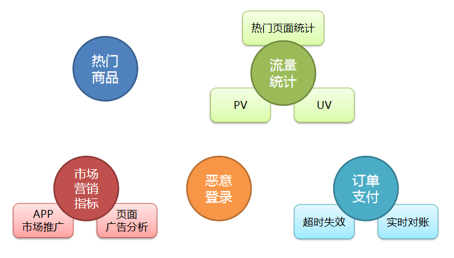
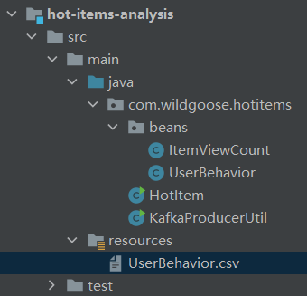
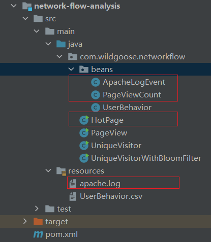
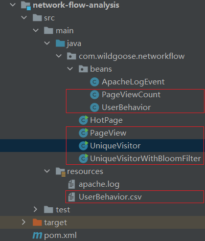
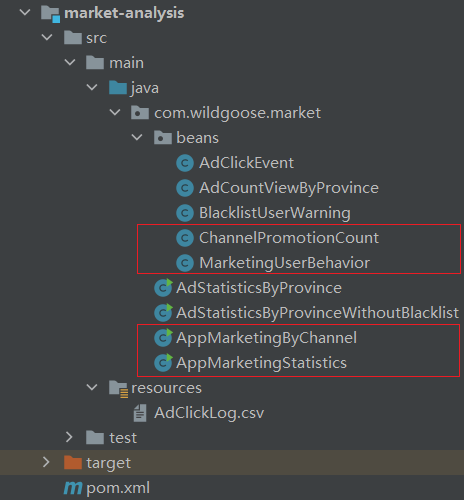
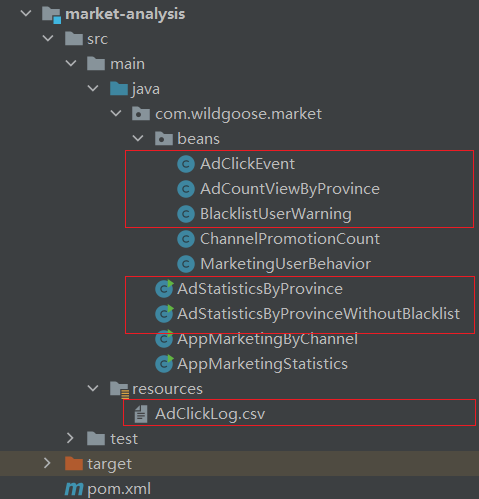
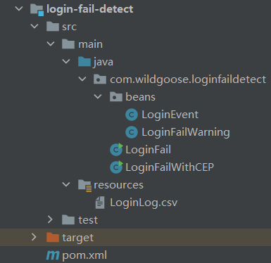
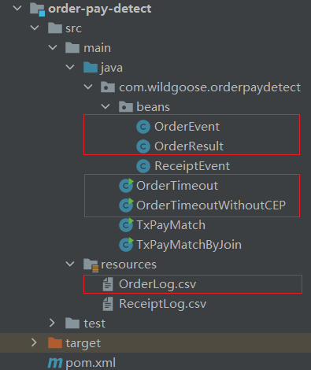
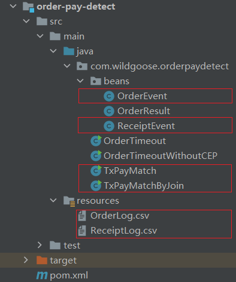

# Flink-电商用户行为数据分析

## 1 项目整体介绍

### 1.1 电商的用户行为

电商平台中的用户行为频繁且较复杂，系统上线运行一段时间后，可以收集到大量的用户行为数据，进而利用大数据技术进行深入挖掘和分析，得到感兴趣的商业指标并增强对风险的控制。

电商用户行为数据多样，整体可以分为**用户行为习惯数据**和**业务行为数据**两大类。

- 用户的行为习惯数据包括了用户的登录方式、上线的时间点及时长、点击和浏览页面、页面停留时间以及页面跳转等等，我们可以从中进行流量统计和热门商品的统计，也可以深入挖掘用户的特征；这些数据往往可以从web服务器日志中直接读取到。

- 业务行为数据就是用户在电商平台中针对每个业务（通常是某个具体商品）所作的操作，我们一般会在业务系统中相应的位置埋点，然后收集日志进行分析。业务行为数据又可以简单分为两类：
  - 一类是能够明显地表现出**用户兴趣**的行为，比如对商品的收藏、喜欢、评分和评价，我们可以从中对数据进行深入分析，得到用户画像，进而对用户给出个性化的推荐商品列表，这个过程往往会用到机器学习相关的算法；
  - 另一类则是**常规的业务操作**，但需要着重关注一些异常状况以做好风控，比如登录和订单支付。


### 1.2 项目的主要模块

基于对电商用户行为数据的基本分类，我们可以发现主要有以下三个分析方向：
1. 热门统计

  利用用户的点击浏览行为，进行流量统计、近期热门商品统计等。

2. 偏好统计

  利用用户的偏好行为，比如收藏、喜欢、评分等，进行用户画像分析，给出个性化的商品推荐列表。

3. 风险控制

  利用用户的常规业务行为，比如登录、下单、支付等，分析数据，对异常情况进行报警提示。

本项目限于数据，我们只实现热门统计和风险控制中的部分内容，将包括以下五大模块：1）实时热门商品统计；2）实时流量统计；3）市场营销商业指标统计；4）恶意登录监控；5）订单支付失效监控，其中细分为以下9个具体指标：

| 实时统计分析                      | 业务流程及风险控制 |
| --------------------------------- | ------------------ |
| 实时热门商品统计（hot-item）      | 页面广告黑名单过滤 |
| 实时热门页面流量统计（hot-page）  | 恶意登录监控       |
| 实时访问流量统计（page-view，pv） | 订单支付失效监控   |
| APP市场推广统计                   | 支付实时对账       |
| 页面广告点击量统计                |                    |

由于对实时性要求较高，我们会用 flink 作为数据处理的框架。在项目中，我们将综合运用 flink 的各种 API，基于 EventTime 去处理基本的业务需求，并且灵活地使用底层的 processFunction，基于状态编程和 CEP 去处理更加复杂的情形。


### 1.3 数据源解析

#### 1.3.1 <a id="jump-to-UserBehavior">UserBehavior.csv</a>

我们准备了一份淘宝用户行为数据集，保存为 csv 文件。本数据集包含了淘宝上某一天随机一百万用户的所有行为（包括点击 、购买、 收藏、喜欢 ） 。数据集的每一行表示一条用户行为，由用户 ID、商品 ID、商品类目 ID、行为类型和时间戳组成，并以逗号分隔。关于数据集中每一列的详细描述如下：

| 字段名     | 数据类型 | 说明                          |
| ---------- | -------- | ----------------------------- |
| userId     | Long     | 加密后的用户 ID               |
| itemId     | Long     | 加密后的商品 ID               |
| categoryId | Integer  | 加密后的商品所属类别 ID       |
| behavior   | String   | 用户行为类型，pv/buy/cart/fav |
| timestamp  | Long     | 行为发生的时间戳，单位秒      |

使用场景：

- [实时热门商品统计](#jump-to-HotItemsAnalysis)
- [实时流量统计——网络流量统计](#jump-to-NetworkFlowAnalysis-PV&UV)


**UserBehavior.java**

```java
package com.wildgoose.hotitems.beans;

/**
 * @Classname : UserBehavior
 * @Description : 用户行为类
 * @Created by : JustxzzZ
 * @Date : 2023.04.25 11:05
 */
public class UserBehavior {

    private Long userId;        // 用户ID
    private Long itemId;        // 商品ID
    private Integer categoryId; // 商品所属类型ID
    private String behavior;    // 用户行为类型，包含pv、buy、cart、fav
    private Long timestamp;     // 行为发生时间戳，单位秒

    public UserBehavior() {
    }

    public UserBehavior(Long userId, Long itemId, Integer categoryId, String behavior, Long timestamp) {
        this.userId = userId;
        this.itemId = itemId;
        this.categoryId = categoryId;
        this.behavior = behavior;
        this.timestamp = timestamp;
    }

    public Long getUserId() {
        return userId;
    }

    public void setUserId(Long userId) {
        this.userId = userId;
    }

    public Long getItemId() {
        return itemId;
    }

    public void setItemId(Long itemId) {
        this.itemId = itemId;
    }

    public Integer getCategoryId() {
        return categoryId;
    }

    public void setCategoryId(Integer categoryId) {
        this.categoryId = categoryId;
    }

    public String getBehavior() {
        return behavior;
    }

    public void setBehavior(String behavior) {
        this.behavior = behavior;
    }

    public Long getTimestamp() {
        return timestamp;
    }

    public void setTimestamp(Long timestamp) {
        this.timestamp = timestamp;
    }

    @Override
    public String toString() {
        return "UserBehavior{" +
                "UserId=" + userId +
                ", itemId=" + itemId +
                ", categoryId=" + categoryId +
                ", behavior='" + behavior + '\'' +
                ", timestamp=" + timestamp +
                '}';
    }
}
```


#### 1.3.2 <a id="jump-to-apache">apache.log</a>

另外，我们还可以拿到 web 服务器的日志数据，这里以 apache 服务器的一份 log 为例，每一行日志记录了访问者的 IP、userId、访问时间、访问方法以及访问的 url，具体描述如下：

| 字段名    | 数据类型 | 说明                          |
| --------- | -------- | ----------------------------- |
| ip        | String   | 访问的 IP                     |
| userId    | Long     | 访问的 userId                 |
| eventTime | Long     | 访问时间                      |
| method    | String   | 访问方法，GET/PSOT/PUT/DELETE |
| url       | String   | 访问的 url                    |

使用场景：

- [实时流量统计——热门页面访问量统计](#jump-to-NetworkFlowAnalysis-HotPages)


**ApacheLogEvent.java**

```java
package com.wildgoose.networkflow.beans;

/**
 * @Description : 事件日志
 * @Author : JustxzzZ
 * @Date : 2023.04.25 17:49
 */
public class ApacheLogEvent {

    private String ip;      // 访问的 IP
    private Long userId;    // 访问的 userId
    private Long eventTime; // 访问时间
    private String method;  // 访问方式，GET/POST/PUT/DELETE
    private String url;     // 访问的 url

    public ApacheLogEvent() {
    }

    public ApacheLogEvent(String ip, Long userId, Long eventTime, String method, String url) {
        this.ip = ip;
        this.userId = userId;
        this.eventTime = eventTime;
        this.method = method;
        this.url = url;
    }

    public String getIp() {
        return ip;
    }

    public void setIp(String ip) {
        this.ip = ip;
    }

    public Long getUserId() {
        return userId;
    }

    public void setUserId(Long userId) {
        this.userId = userId;
    }

    public Long getEventTime() {
        return eventTime;
    }

    public void setEventTime(Long eventTime) {
        this.eventTime = eventTime;
    }

    public String getMethod() {
        return method;
    }

    public void setMethod(String method) {
        this.method = method;
    }

    public String getUrl() {
        return url;
    }

    public void setUrl(String url) {
        this.url = url;
    }

    @Override
    public String toString() {
        return "ApacheLogEvent{" +
                "ip='" + ip + '\'' +
                ", userId=" + userId +
                ", eventTime=" + eventTime +
                ", method='" + method + '\'' +
                ", url='" + url + '\'' +
                '}';
    }
}
```


由于行为数据有限，在实时热门商品统计模块中可以使用 UserBehavior 数据集，而对于恶意登录监控和订单支付失效监控，我们只以示例数据来做演示。

下面是相关的示例数据：

#### 1.3.3 <a id="jump-to-MarketingUserBehavior">MarketingUserBehavior</a>

| 字段名    | 数据类型 | 说明                                         |
| --------- | -------- | -------------------------------------------- |
| userId    | Long     | 用户 ID                                      |
| behavior  | String   | 用户行为，CLICK/DOWNLOAD/INSTALL/UNINSTALL等 |
| channel   | String   | 推广渠道，app store/wechat/weibo/browser等   |
| timestamp | Long     | 时间戳                                       |

使用场景：

- [市场营销商业指标统计分析——市场推广统计](#jump-to-MarketAnalysis-AppMarketing)


**MarketingUserBehavior.java**

```java
package com.wildgoose.market.beans;

/**
 * @Description : 营销用户行为
 * @Author : JustxzzZ
 * @Date : 2023.05.02 17:09
 */
public class MarketingUserBehavior {

    private Long userId;
    private String behavior;
    private String channel;
    private Long timestamp;

    public MarketingUserBehavior() {
    }

    public MarketingUserBehavior(Long userId, String behavior, String channel, Long timestamp) {
        this.userId = userId;
        this.behavior = behavior;
        this.channel = channel;
        this.timestamp = timestamp;
    }

    public Long getUserId() {
        return userId;
    }

    public void setUserId(Long userId) {
        this.userId = userId;
    }

    public String getBehavior() {
        return behavior;
    }

    public void setBehavior(String behavior) {
        this.behavior = behavior;
    }

    public String getChannel() {
        return channel;
    }

    public void setChannel(String channel) {
        this.channel = channel;
    }

    public Long getTimestamp() {
        return timestamp;
    }

    public void setTimestamp(Long timestamp) {
        this.timestamp = timestamp;
    }

    @Override
    public String toString() {
        return "MarketingUserBehavior{" +
                "userId=" + userId +
                ", behavior='" + behavior + '\'' +
                ", channel='" + channel + '\'' +
                ", timestamp=" + timestamp +
                '}';
    }
}
```


#### 1.3.4 <a id="jump-to-AdClickLog">AdClickLog.csv</a>

| 字段名    | 数据类型 | 说明    |
| --------- | -------- | ------- |
| userId    | Long     | 用户 ID |
| adId      | Long     | 广告 ID |
| province  | String   | 省份    |
| city      | String   | 城市    |
| timestamp | Long     | 时间戳  |

使用场景：

- [市场营销商业指标统计分析——页面广告统计](#jump-to-MarketAnalysis-AdStatistics)


**AdClickEvent.java**

```java
package com.wildgoose.market.beans;

/**
 * @Description : 广告点击事件
 * @Author : JustxzzZ
 * @Date : 2023.05.02 19:24
 */
public class AdClickEvent {

    private Long userId;
    private Long adId;
    private String province;
    private String city;
    private Long timestamp;

    public AdClickEvent() {
    }

    public AdClickEvent(Long userId, Long adId, String province, String city, Long timestamp) {
        this.userId = userId;
        this.adId = adId;
        this.province = province;
        this.city = city;
        this.timestamp = timestamp;
    }

    public Long getUserId() {
        return userId;
    }

    public void setUserId(Long userId) {
        this.userId = userId;
    }

    public Long getAdId() {
        return adId;
    }

    public void setAdId(Long adId) {
        this.adId = adId;
    }

    public String getProvince() {
        return province;
    }

    public void setProvince(String province) {
        this.province = province;
    }

    public String getCity() {
        return city;
    }

    public void setCity(String city) {
        this.city = city;
    }

    public Long getTimestamp() {
        return timestamp;
    }

    public void setTimestamp(Long timestamp) {
        this.timestamp = timestamp;
    }

    @Override
    public String toString() {
        return "AdClickEvent{" +
                "userId=" + userId +
                ", adId=" + adId +
                ", province='" + province + '\'' +
                ", city='" + city + '\'' +
                ", timestamp=" + timestamp +
                '}';
    }
}
```


#### 1.3.5 <a id="jump-to-LoginLog">LoginLog.csv</a>

| 字段名     | 数据类型 | 说明                   |
| ---------- | -------- | ---------------------- |
| userId     | Long     | 用户 ID                |
| ip         | String   | 登录 IP                |
| loginState | String   | 登录状态，success/fail |
| timestamp  | Long     | 时间戳                 |

使用场景：

- [恶意登录监控](#jump-to-LoginFailDetect)


**LoginEvent.java**

```java
package com.wildgoose.loginfaildetect.beans;

/**
 * @Description : 登录事件
 * @Author : JustxzzZ
 * @Date : 2023.05.04 14:39
 */
public class LoginEvent {

    private Long userId;
    private String ip;
    private String loginState;
    private Long timestamp;

    public LoginEvent() {
    }

    public LoginEvent(Long userId, String ip, String loginState, Long timestamp) {
        this.userId = userId;
        this.ip = ip;
        this.loginState = loginState;
        this.timestamp = timestamp;
    }

    public Long getUserId() {
        return userId;
    }

    public void setUserId(Long userId) {
        this.userId = userId;
    }

    public String getIp() {
        return ip;
    }

    public void setIp(String ip) {
        this.ip = ip;
    }

    public String getLoginState() {
        return loginState;
    }

    public void setLoginState(String loginState) {
        this.loginState = loginState;
    }

    public Long getTimestamp() {
        return timestamp;
    }

    public void setTimestamp(Long timestamp) {
        this.timestamp = timestamp;
    }

    @Override
    public String toString() {
        return "LoginEvent{" +
                "userId=" + userId +
                ", ip='" + ip + '\'' +
                ", loginState='" + loginState + '\'' +
                ", timestamp=" + timestamp +
                '}';
    }
}
```


#### 1.3.6 <a id="jump-to-OrderLog">OrderLog.csv</a>

| 字段名    | 数据类型 | 说明                 |
| --------- | -------- | -------------------- |
| orderId   | Long     | 订单 ID              |
| eventType | String   | 事件类型，create/pay |
| txId      | String   | 交易 ID              |
| timestamp | Long     | 时间戳               |

使用场景：

- [订单支付实时监控——订单支付失效监控](#jump-to-OrderPayDetect-OrderTimeout)
- [订单支付实时监控——支付实时对账](#jump-to-OrderPayDetect-TxPayMatch)


**OrderEvent.java**

```java
package com.wildgoose.orderpaydetect.beans;

/**
 * @Description : 订单事件类
 * @Author : JustxzzZ
 * @Date : 2023.05.05 10:43
 */
public class OrderEvent {

    private Long orderId;
    private String eventType;
    private String txId;
    private Long timestamp;

    public OrderEvent() {
    }

    public OrderEvent(Long orderId, String eventType, String txId, Long timestamp) {
        this.orderId = orderId;
        this.eventType = eventType;
        this.txId = txId;
        this.timestamp = timestamp;
    }

    public Long getOrderId() {
        return orderId;
    }

    public void setOrderId(Long orderId) {
        this.orderId = orderId;
    }

    public String getEventType() {
        return eventType;
    }

    public void setEventType(String eventType) {
        this.eventType = eventType;
    }

    public String getTxId() {
        return txId;
    }

    public void setTxId(String txId) {
        this.txId = txId;
    }

    public Long getTimestamp() {
        return timestamp;
    }

    public void setTimestamp(Long timestamp) {
        this.timestamp = timestamp;
    }

    @Override
    public String toString() {
        return "OrderEvent{" +
                "orderId=" + orderId +
                ", eventType='" + eventType + '\'' +
                ", txId='" + txId + '\'' +
                ", timestamp=" + timestamp +
                '}';
    }
}
```


#### 1.3.7 <a id="jump-to-ReceiptLog">ReceiptLog.csv</a>

| 字段名     | 数据类型 | 说明                    |
| ---------- | -------- | ----------------------- |
| txId       | String   | 交易 ID                 |
| payChannel | String   | 支付渠道，wechat/alipay |
| timestamp  | Long     | 时间戳                  |

使用场景：

- [订单支付实时监控——支付实时对账](#jump-to-OrderPayDetect-TxPayMatch)


**ReceiptEvent.java**

```java
package com.wildgoose.orderpaydetect.beans;

/**
 * @Description : 到账事件
 * @Author : JustxzzZ
 * @Date : 2023.05.05 15:51
 */
public class ReceiptEvent {

    private String txId;
    private String payChannel;
    private Long timestamp;

    public ReceiptEvent() {
    }

    public ReceiptEvent(String txId, String payChannel, Long timestamp) {
        this.txId = txId;
        this.payChannel = payChannel;
        this.timestamp = timestamp;
    }

    public String getTxId() {
        return txId;
    }

    public void setTxId(String txId) {
        this.txId = txId;
    }

    public String getPayChannel() {
        return payChannel;
    }

    public void setPayChannel(String payChannel) {
        this.payChannel = payChannel;
    }

    public Long getTimestamp() {
        return timestamp;
    }

    public void setTimestamp(Long timestamp) {
        this.timestamp = timestamp;
    }

    @Override
    public String toString() {
        return "ReceiptEvent{" +
                "txId='" + txId + '\'' +
                ", payChannel='" + payChannel + '\'' +
                ", timestamp=" + timestamp +
                '}';
    }
}
```


### 1.4 项目模块设计




## 2 实时热门商品统计

1. 基本需求
   1. 统计近1小时内的热门商品，每5分钟更新一次。其中热门度用浏览次数（“pv”）来衡量
   2. 统计近1小时内热度 TopN 的商品，以前 top3 为例
2. 解决思路
   1) 在所有用户行为数据中，过滤出浏览（“pv”）行为进行统计
   2) 根据商品ID分组
   3) 构建滑动窗口，窗口长度为1小时，滑动距离为5分钟
   4) 统计每种商品的访问量
   5) 获取 topN 的商品

3. <a id="jump-to-HotItemsAnalysis">数据源</a>

   - [UserBehavior.csv](#jump-to-UserBehavior)

4. 代码

   

**ItemViewCount.java**

```java
package com.wildgoose.hotitems.beans;

/**
 * @Classname : ItemViewCount
 * @Description : 热门商品访问量
 * @Created by : JustxzzZ
 * @Date : 2023.04.25 11:09
 */
public class ItemViewCount {

    private Long itemId;
    private Long windowEnd;
    private Long count;

    public ItemViewCount() {
    }

    public ItemViewCount(Long itemId, Long windowEnd, Long count) {
        this.itemId = itemId;
        this.windowEnd = windowEnd;
        this.count = count;
    }

    public Long getItemId() {
        return itemId;
    }

    public void setItemId(Long itemId) {
        this.itemId = itemId;
    }

    public Long getWindowEnd() {
        return windowEnd;
    }

    public void setWindowEnd(Long windowEnd) {
        this.windowEnd = windowEnd;
    }

    public Long getCount() {
        return count;
    }

    public void setCount(Long count) {
        this.count = count;
    }

    @Override
    public String toString() {
        return "ItemViewCount{" +
                "itemId=" + itemId +
                ", windowEnd=" + windowEnd +
                ", count=" + count +
                '}';
    }
}
```

**HotItem.java**

```java
/**
 * @Description : 热门商品分析，实时返回浏览量前N的商品
 * @Author : JustxzzZ
 * @Date : 2023.04.25 11:13
 */
public class HotItem {
    public static void main(String[] args) throws Exception {

        // 1.创建执行环境
        StreamExecutionEnvironment env = StreamExecutionEnvironment.getExecutionEnvironment();
        env.setStreamTimeCharacteristic(TimeCharacteristic.EventTime);

//        // 2.读取数据，该数据严格顺序
//        DataStreamSource<String> inputStream =
//                env.readTextFile("hot-items-analysis/src/main/resources/UserBehavior.csv");

        // 用 kafka 作为数据源
        Properties properties = new Properties();
        properties.setProperty("bootstrap.servers", "hadoop102:9092");
        properties.setProperty("group.id", "consumer-group");
        properties.setProperty("key.deserializer", "org.apache.kafka.common.serialization.StringDeserializer");
        properties.setProperty("value.deserializer", "org.apache.kafka.common.serialization.StringDeserializer");
        properties.setProperty("auto.offset.reset", "latest");

        DataStreamSource<String> inputStream =
                env.addSource(new FlinkKafkaConsumer<String>("hot_items", new SimpleStringSchema(), properties));

        // 3.转换成POJOs，并指定 eventTime 字段
        SingleOutputStreamOperator<UserBehavior> dataStream = inputStream.map(line -> {
            String[] fields = line.split(",");
            return new UserBehavior(
                    new Long(fields[0]), new Long(fields[1]), new Integer(fields[2]), fields[3], new Long(fields[4])
            );
        }).assignTimestampsAndWatermarks(new AscendingTimestampExtractor<UserBehavior>() {
            @Override
            public long extractAscendingTimestamp(UserBehavior element) {
                return element.getTimestamp() * 1000L;
            }
        });

        // TODO 4.热门商品分析
        SingleOutputStreamOperator<ItemViewCount> itemCountStream = dataStream
                .filter(data -> data.getBehavior().equals("pv"))            // 筛选用户行为为点击的数据
                .keyBy("itemId")                                     // 根据商品ID分组
                .timeWindow(Time.minutes(60), Time.minutes(5))              // 开窗，步长1小时，滑动距离5分钟
                .aggregate(new ItemCountAgg(), new WindowResultFunction())  // 统计每个窗口中每种商品的访问量
                ;

        SingleOutputStreamOperator<String> hotItemStream = itemCountStream
                .keyBy("windowEnd")                                  // 根据窗口分组
                .process(new TopNHotItem(3))                         // 统计每个窗口中访问量前N的商品
                ;

        // 5.输出结果
        hotItemStream.print("HotItemTopN");

        // 6.执行
        env.execute("hot-item");

    }


    /**
     * 自定义预聚合函数，每来一个数据就 count + 1
     */
    private static class ItemCountAgg implements AggregateFunction<UserBehavior, Long, Long> {
        @Override
        public Long createAccumulator() {
            return 0L;
        }

        @Override
        public Long add(UserBehavior value, Long accumulator) {
            return accumulator + 1L;
        }

        @Override
        public Long getResult(Long accumulator) {
            return accumulator;
        }

        @Override
        public Long merge(Long a, Long b) {
            return a + b;
        }
    }

    /**
     * 自定义窗口函数，结合窗口信息，输出当前 count 结果
     */
    private static class WindowResultFunction implements WindowFunction<Long, ItemViewCount, Tuple, TimeWindow> {
        @Override
        public void apply(Tuple tuple,
                          TimeWindow window,
                          Iterable<Long> input,
                          Collector<ItemViewCount> out) throws Exception {

             out.collect(new ItemViewCount(tuple.getField(0), window.getEnd(), input.iterator().next()));

        }
    }

    /**
     * 自定义排序函数，输出热门商品 topN
     */
    private static class TopNHotItem extends KeyedProcessFunction<Tuple, ItemViewCount, String> {

        private Integer topSize;
        // 状态变量，保存每个 itemViewCount
        private ListState<ItemViewCount> itemViewCountListState;

        public TopNHotItem(Integer topSize) {
            this.topSize = topSize;
        }

        @Override
        public void open(Configuration parameters) throws Exception {
            // 获取状态变量
            itemViewCountListState = getRuntimeContext()
                    .getListState(new ListStateDescriptor<>("item-count-list", ItemViewCount.class));
        }

        @Override
        public void processElement(ItemViewCount value,
                                   KeyedProcessFunction<Tuple, ItemViewCount, String>.Context ctx,
                                   Collector<String> out) throws Exception {

            // 将到来的 itemViewCount 添加到状态变量
            itemViewCountListState.add(value);
            // 注册一个定时器，延迟1s触发
            ctx.timerService().registerEventTimeTimer(value.getWindowEnd() + 1L);

        }

        @Override
        public void onTimer(long timestamp,
                            KeyedProcessFunction<Tuple, ItemViewCount, String>.OnTimerContext ctx,
                            Collector<String> out) throws Exception {

            // 将 ListState 转换成 List，方便排序
            List<ItemViewCount> itemViewCounts = Lists.newArrayList(itemViewCountListState.get().iterator());
            itemViewCounts.sort((o1, o2) -> o2.getCount().intValue() - o1.getCount().intValue());

            // 定义一个输出结果字符串
            StringBuilder result = new StringBuilder();
            result.append("\n========================================\n");
            result.append("窗口结束时间：").append(new Timestamp(timestamp - 1)).append("\n");

            for (int i = 0; i < Math.min(topSize, itemViewCounts.size()); i++) {
                ItemViewCount itemViewCount = itemViewCounts.get(i);
                result.append("No.").append(i + 1).append(": ").append("\t")
                        .append("商品ID=").append(itemViewCount.getItemId()).append("\t")
                        .append("浏览量=").append(itemViewCount.getCount()).append("\n");
            }

            result.append("========================================\n\n");

            Thread.sleep(1000);

            // 输出
            out.collect(result.toString());

        }
    }
}
```

**KafkaProducerUtil.java**

```java
package com.wildgoose.hotitems;

import org.apache.kafka.clients.producer.KafkaProducer;
import org.apache.kafka.clients.producer.ProducerRecord;

import java.io.BufferedReader;
import java.io.FileReader;
import java.util.Properties;

/**
 * @Description : 定义一个 Kafka 生产者，往 hot_items 主题中实时写入数据
 * @Author : JustxzzZ
 * @Date : 2023.05.02 11:11
 */
public class KafkaProducerUtil {
    public static void main(String[] args) throws Exception {

        writeToKafka("hot_items");

    }

    public static void writeToKafka(String topic) throws Exception {

        // Kafka 配置信息
        Properties properties = new Properties();
        properties.setProperty("bootstrap.servers", "hadoop102:9092");
        properties.setProperty("key.serializer", "org.apache.kafka.common.serialization.StringSerializer");
        properties.setProperty("value.serializer", "org.apache.kafka.common.serialization.StringSerializer");

        // 定义一个 Kafka Producer
        KafkaProducer<String, String> kafkaProducer = new KafkaProducer<>(properties);

        // 用缓冲方式读取文件
        BufferedReader bufferedReader = new BufferedReader(
                new FileReader("hot-items-analysis/src/main/resources/UserBehavior.csv"));

        String line;

        while ((line = bufferedReader.readLine()) != null) {
            ProducerRecord<String, String> producerRecord = new ProducerRecord<>(topic, line);
            // 用 producer 发送数据
            kafkaProducer.send(producerRecord);
        }

        kafkaProducer.close();

    }
}
```


## 3 实时流量统计

### 3.1 热门页面访问量统计

1. 基本需求

   1. 从web服务器的日志中，统计实时的热门访问页面
   2. 统计每分钟的ip访问量，取出访问量最大的5个地址，每5秒更新一次

2. 解决思路

   1. 将 apache 服务器日志中的时间，转换为时间戳，作为 EventTime
   2. 按页面ID（url）分组
   3. 构建滑动窗口，窗口长度为1分钟，滑动距离为5秒
   4. 统计每个页面的访问量
   5. 获取访问量 TopN 的页面，以 top5 为例

3. <a id="jump-to-NetworkFlowAnalysis-HotPages">数据源</a>

   - [apache.log](#jump-to-apache)

4. 代码

   

   

   **PageViewCount.java**

   ```java
   package com.wildgoose.networkflow.beans;
   
   /**
    * @Description : url 访问量展示类，展示每个窗口中每个 url 的访问量
    * @Author : JustxzzZ
    * @Date : 2023.04.26 9:31
    */
   public class PageViewCount {
   
       private String url;
       private Long windowEnd;
       private Long count;
   
       public PageViewCount() {
       }
   
       public PageViewCount(String url, Long windowEnd, Long count) {
           this.url = url;
           this.windowEnd = windowEnd;
           this.count = count;
       }
   
       public String getUrl() {
           return url;
       }
   
       public void setUrl(String url) {
           this.url = url;
       }
   
       public Long getWindowEnd() {
           return windowEnd;
       }
   
       public void setWindowEnd(Long windowEnd) {
           this.windowEnd = windowEnd;
       }
   
       public Long getCount() {
           return count;
       }
   
       public void setCount(Long count) {
           this.count = count;
       }
   
       @Override
       public String toString() {
           return "UrlViewCount{" +
                   "url='" + url + '\'' +
                   ", windowEnd=" + windowEnd +
                   ", count=" + count +
                   '}';
       }
   }
   ```

   **HotPage.java**

   ```java
   /**
    * @Description : 实时流量统计 - 热门页面浏览数
    *      1.需求描述：读取服务器日志中的每一行 log，统计在一段时间内用户访问每一个 url 的次数，然后排序输出显示。
    *      2.实现逻辑：每隔 5 秒，输出最近 10 分钟内访问量最多的前 N 个 URL.
    * @Author : JustxzzZ
    * @Date : 2023.04.25 16:57
    */
   public class HotPage {
       public static void main(String[] args) throws Exception {
   
           // 1.创建执行环境
           StreamExecutionEnvironment env = StreamExecutionEnvironment.getExecutionEnvironment();
           env.setStreamTimeCharacteristic(TimeCharacteristic.EventTime);
   //        env.setParallelism(1);
   
           // 2.读取数据，该数据存在乱序
           DataStreamSource<String> inputStream =
                   env.readTextFile("network-flow-analysis/src/main/resources/apache.log");
   
           // 3.转换成POJOs，并指定 eventTime 字段
           SingleOutputStreamOperator<ApacheLogEvent> dataStream = inputStream.map(line -> {
               String[] fields = line.split(" ");
               SimpleDateFormat simpleDateFormat = new SimpleDateFormat("dd/MM/yyyy:HH:mm:ss");
               Long timestamp = simpleDateFormat.parse(fields[3]).getTime();
               return new ApacheLogEvent(fields[0], 0L, timestamp, fields[5], fields[6]);
           }).assignTimestampsAndWatermarks(new BoundedOutOfOrdernessTimestampExtractor<ApacheLogEvent>(Time.seconds(1)) {
               @Override
               public long extractTimestamp(ApacheLogEvent element) {
                   return element.getEventTime();
               }
           });
   
           // TODO 4.流量分析
           // keyedBy(url) -> window -> aggregate
   
           // 定义一个侧输出流 Tag
           OutputTag<ApacheLogEvent> lateTag = new OutputTag<ApacheLogEvent>("late") {};
   
           SingleOutputStreamOperator<PageViewCount> pageCountStream = dataStream
                   .filter(data -> "GET".equals(data.getMethod()))
                   .filter( data -> {
                       String regex = "^((?!\\.(css|js|png|ico)$).)*$";
                       return Pattern.matches(regex, data.getUrl());
                   } )
                   .keyBy("url")
                   .timeWindow(Time.minutes(10), Time.seconds(5))
                   .allowedLateness(Time.minutes(1))
                   .sideOutputLateData(lateTag)
                   .aggregate(new PageCountAgg(), new PageCountWindow());
   
           // keyedBy(window) -> process
           SingleOutputStreamOperator<String> hotPageTopNStream = pageCountStream
                   .keyBy("windowEnd")
                   .process(new HotPageTopN(5));
   
   
           // 5.数据结果
           hotPageTopNStream.print("HotPageTopN");
           pageCountStream.getSideOutput(lateTag).print("late");
   
           // 6.执行
           env.execute("network-flow-hot-page");
   
       }
   
       /**
        * 自定义预聚合函数，针对每个窗口，每来一条数据，计数加1
        */
       private static class PageCountAgg implements AggregateFunction<ApacheLogEvent, Long, Long> {
   
           @Override
           public Long createAccumulator() {
               return 0L;
           }
   
           @Override
           public Long add(ApacheLogEvent value, Long accumulator) {
               return accumulator + 1;
           }
   
           @Override
           public Long getResult(Long accumulator) {
               return accumulator;
           }
   
           @Override
           public Long merge(Long a, Long b) {
               return a + b;
           }
       }
   
       /**
        * 自定义窗口函数，结合窗口信息，返回每个窗口中每个 url 的访问次数
        */
       private static class PageCountWindow implements WindowFunction<Long, PageViewCount, Tuple, TimeWindow> {
   
           @Override
           public void apply(Tuple tuple,
                             TimeWindow window,
                             Iterable<Long> input,
                             Collector<PageViewCount> out) throws Exception {
   
               out.collect(new PageViewCount(tuple.getField(0), window.getEnd(), input.iterator().next()));
   
           }
       }
   
       /**
        * 自定义排序函数，输出访问量前 N 的 url
        */
       private static class HotPageTopN extends KeyedProcessFunction<Tuple, PageViewCount, String> {
   
           private Integer topSize;
           private MapState<String, Long> pageViewCountMapState;
   
           public HotPageTopN(Integer topSize) {
               this.topSize = topSize;
           }
   
           @Override
           public void open(Configuration parameters) throws Exception {
               pageViewCountMapState = getRuntimeContext().getMapState(
                       new MapStateDescriptor<>("page-count-map", String.class, Long.class));
           }
   
           @Override
           public void processElement(PageViewCount value,
                                      KeyedProcessFunction<Tuple, PageViewCount, String>.Context ctx,
                                      Collector<String> out) throws Exception {
   
               pageViewCountMapState.put(value.getUrl(), value.getCount());
   
               ctx.timerService().registerEventTimeTimer(value.getWindowEnd() + 1L);
               ctx.timerService().registerEventTimeTimer(value.getWindowEnd() + 60 * 1000L);   // 与延迟一分钟关闭窗口对应，用来清空状态
   
           }
   
           @Override
           public void onTimer(long timestamp,
                               KeyedProcessFunction<Tuple, PageViewCount, String>.OnTimerContext ctx,
                               Collector<String> out) throws Exception {
   
               // 先判断是否到了窗口关闭清理时间，如果是，直接清空状态
               if (timestamp == ((long) ctx.getCurrentKey().getField(0) + 60 * 1000L)) {
                   pageViewCountMapState.clear();
                   return;
               }
   
               List<Map.Entry<String, Long>> pageViewCounts = Lists.newArrayList(pageViewCountMapState.entries().iterator());
   
               pageViewCounts.sort(new Comparator<Map.Entry<String, Long>>() {
                   @Override
                   public int compare(Map.Entry<String, Long> o1, Map.Entry<String, Long> o2) {
                       return o2.getValue().compareTo(o1.getValue());
                   }
               });
   
               StringBuilder result = new StringBuilder();
               result.append("\n===========================================\n");
               result.append("窗口结束时间：").append(new Timestamp(timestamp - 1)).append("\n");
   
               for (int i = 0; i < Math.min(topSize, pageViewCounts.size()); i++) {
                   Map.Entry<String, Long> pageViewCount = pageViewCounts.get(i);
                   result.append("No.").append(i + 1).append(":").append("\t")
                           .append("访问量=").append(pageViewCount.getValue()).append("\t")
                           .append("url=").append(pageViewCount.getKey()).append("\n");
               }
   
               result.append("===========================================\n\n");
   
               Thread.sleep(500);
   
               out.collect(result.toString());
           }
       }
   }
   ```


### 3.2 网络流量统计

1. 基本需求
   1. 从埋点日志中，统计实时的 PV 和 UV
   2. 统计每小时的访问量（PV），并且对用户进行去重（UV）
2. 解决思路
   1. 统计埋点日志中的 pv 行为，利用 Set 数据结构进行去重计算 uv
   2. 对于超大规模的数据，可以考虑用布隆过滤器进行去重

3. <a id="jump-to-NetworkFlowAnalysis-PV&UV">数据源</a>

   - [UserBehavior.csv](#jump-to-UserBehavior)

4. 代码

   

   

#### 3.2.1 网站总访问量（PV）统计

**PageView.java**

```java
/**
 * @Description : 实时流量分析 - 页面访问量 PV
 * @Author : JustxzzZ
 * @Date : 2023.04.28 10:36
 */
public class PageView {
    public static void main(String[] args) throws Exception {

        // 1.创建执行环境
        StreamExecutionEnvironment env = StreamExecutionEnvironment.getExecutionEnvironment();
        env.setStreamTimeCharacteristic(TimeCharacteristic.EventTime);

        // 2.读取数据源
        DataStreamSource<String> inputStream =
                env.readTextFile("network-flow-analysis/src/main/resources/UserBehavior.csv");

        // 3.转换成 POJOs ，并指定 eventTime 字段
        SingleOutputStreamOperator<UserBehavior> dataStream = inputStream.map(line -> {
            String[] fields = line.split(",");
            return new UserBehavior(
                    new Long(fields[0]), new Long(fields[1]), new Integer(fields[2]), fields[3], new Long(fields[4])
            );
        }).assignTimestampsAndWatermarks(new AscendingTimestampExtractor<UserBehavior>() {
            @Override
            public long extractAscendingTimestamp(UserBehavior element) {
                return element.getTimestamp() * 1000L;
            }
        });

        // TODO 4.统计流量 - PV
//        SingleOutputStreamOperator<Tuple2<String, Integer>> pvStream = dataStream
//                .filter(data -> "pv".equals(data.getBehavior()))
//                .map(new MapFunction<UserBehavior, Tuple2<String, Integer>>() {
//                    @Override
//                    public Tuple2<String, Integer> map(UserBehavior value) throws Exception {
//                        return new Tuple2<>(value.getBehavior(), 1);
//                    }
//                })
//                .keyBy(0)
//                .timeWindow(Time.hours(1))
//                .sum(1);

        // 统计 PV - 并行度优化，将 key 打散
        SingleOutputStreamOperator<PageViewCount> pvStream = dataStream
                .filter(data -> "pv".equals(data.getBehavior()))
                .map(new MapFunction<UserBehavior, Tuple2<Integer, Long>>() {
                    @Override
                    public Tuple2<Integer, Long> map(UserBehavior value) throws Exception {
                        Random random = new Random();
                        return new Tuple2<>(random.nextInt(10), 1L);
                    }
                })
                .keyBy(data -> data.f0)
                .timeWindow(Time.hours(1))
                .aggregate(new PvCountAgg(), new PvCountWindow())
                .keyBy(PageViewCount::getWindowEnd)
                .process(new TotalPvCount());

        // 5.输出结果
        pvStream.print("pv");

        // 6.执行
        env.execute("network-flow-pv");

    }


    /**
     * 自定义聚合函数，统计每个窗口内不同 key 值的数量
     */
    private static class PvCountAgg implements AggregateFunction<Tuple2<Integer, Long>, Long, Long> {
        @Override
        public Long createAccumulator() {
            return 0L;
        }

        @Override
        public Long add(Tuple2<Integer, Long> value, Long accumulator) {
            return accumulator + value.f1;
        }

        @Override
        public Long getResult(Long accumulator) {
            return accumulator;
        }

        @Override
        public Long merge(Long a, Long b) {
            return a + b;
        }
    }


    /**
     * 自定义窗口函数，获取每个窗口中不同 key 值的数量及窗口信息，并包装成 POJO
     */
    private static class PvCountWindow implements WindowFunction<Long, PageViewCount, Integer, TimeWindow> {
        @Override
        public void apply(Integer integer, TimeWindow window, Iterable<Long> input, Collector<PageViewCount> out) throws Exception {
            out.collect(new PageViewCount(integer.toString(), window.getEnd(), input.iterator().next()));
        }
    }


    /**
     * 自定义处理函数，把相同窗口分组统计的count值叠加
     */
    private static class TotalPvCount extends KeyedProcessFunction<Long, PageViewCount, PageViewCount> {

        // 定义一个状态变量，保存每个窗口中的 pv 总数
        private ValueState<Long> totalCountState;

        @Override
        public void open(Configuration parameters) throws Exception {
            totalCountState = getRuntimeContext().getState(
                    new ValueStateDescriptor<Long>("total-count", Long.class, 0L));
        }

        @Override
        public void processElement(PageViewCount value,
                                   KeyedProcessFunction<Long, PageViewCount, PageViewCount>.Context ctx,
                                   Collector<PageViewCount> out) throws Exception {

            // 更新状态
            totalCountState.update(totalCountState.value() + value.getCount());
            // 定义定时器
            ctx.timerService().registerEventTimeTimer(value.getWindowEnd() + 1);

        }

        @Override
        public void onTimer(long timestamp,
                            KeyedProcessFunction<Long, PageViewCount, PageViewCount>.OnTimerContext ctx,
                            Collector<PageViewCount> out) throws Exception {

            // 触发定时器，输出结果
            out.collect(new PageViewCount("pv", ctx.getCurrentKey(), totalCountState.value()));

            // 清空状态
            totalCountState.clear();

        }
    }
}
```


#### 3.2.2 网站独立访客数（UV）统计

##### 3.2.2.1 基于 Set 实现

**UniqueVisitor.java**

```java
/**
 * @Description : 实时流量分析 - 独立访客数 UV
 * @Author : JustxzzZ
 * @Date : 2023.04.28 15:24
 */
public class UniqueVisitor {
    public static void main(String[] args) throws Exception {

        // 1.创建执行环境
        StreamExecutionEnvironment env = StreamExecutionEnvironment.getExecutionEnvironment();
        env.setStreamTimeCharacteristic(TimeCharacteristic.EventTime);
        env.setParallelism(1);

        // 2.读取数据源
        DataStreamSource<String> inputStream =
                env.readTextFile("network-flow-analysis/src/main/resources/UserBehavior.csv");

        // 3.转换成 POJOs ，并指定 eventTime 字段
        SingleOutputStreamOperator<UserBehavior> dataStream = inputStream.map(line -> {
            String[] fields = line.split(",");
            return new UserBehavior(
                    new Long(fields[0]), new Long(fields[1]), new Integer(fields[2]), fields[3], new Long(fields[4])
            );
        }).assignTimestampsAndWatermarks(new AscendingTimestampExtractor<UserBehavior>() {
            @Override
            public long extractAscendingTimestamp(UserBehavior element) {
                return element.getTimestamp() * 1000L;
            }
        });

        // TODO 4.统计流量 - UV
        SingleOutputStreamOperator<PageViewCount> uvStream = dataStream
                .filter(data -> "pv".equals(data.getBehavior()))
                .timeWindowAll(Time.hours(1))
                .apply(new UvCount());

        // 5.输出结果
        uvStream.print("pv");

        // 6.执行
        env.execute("network-flow-uv");

    }

    /**
     * 自定义全窗口函数类 - 统计页面 UV
     */
    private static class UvCount implements AllWindowFunction<UserBehavior, PageViewCount, TimeWindow> {

        @Override
        public void apply(TimeWindow window, Iterable<UserBehavior> values, Collector<PageViewCount> out) throws Exception {

            // 定义一个集合，保存 userId 状态
            HashSet<Long> userIdSet = new HashSet<>();

            for (UserBehavior value : values) {
                userIdSet.add(value.getUserId());
            }

            out.collect(new PageViewCount("uv", window.getEnd(), (long) userIdSet.size()));

        }
    }
}
```


##### 3.2.2.2 基于布隆过滤器实现

**UniqueVisitorWithBloomFilter.java**

```java
/**
 * @Description : 实时流量分析 - 独立访客数 UV
 * @Author : JustxzzZ
 * @Date : 2023.04.28 15:24
 */
public class UniqueVisitorWithBloomFilter {
    public static void main(String[] args) throws Exception {

        // 1.创建执行环境
        StreamExecutionEnvironment env = StreamExecutionEnvironment.getExecutionEnvironment();
        env.setStreamTimeCharacteristic(TimeCharacteristic.EventTime);
        env.setParallelism(1);

        // 2.读取数据源
        DataStreamSource<String> inputStream =
                env.readTextFile("network-flow-analysis/src/main/resources/UserBehavior.csv");

        // 3.转换成 POJOs ，并指定 eventTime 字段
        SingleOutputStreamOperator<UserBehavior> dataStream = inputStream.map(line -> {
            String[] fields = line.split(",");
            return new UserBehavior(
                    new Long(fields[0]), new Long(fields[1]), new Integer(fields[2]), fields[3], new Long(fields[4])
            );
        }).assignTimestampsAndWatermarks(new AscendingTimestampExtractor<UserBehavior>() {
            @Override
            public long extractAscendingTimestamp(UserBehavior element) {
                return element.getTimestamp() * 1000L;
            }
        });

        // TODO 4.统计流量 - UV
        SingleOutputStreamOperator<PageViewCount> uvStream = dataStream
                .filter(data -> "pv".equals(data.getBehavior()))
                .timeWindowAll(Time.hours(1))
                .trigger(new MyTrigger())
                .process(new UvCountWithBloomFilter());

        // 5.输出结果
        uvStream.print("pv");

        // 6.执行
        env.execute("network-flow-uv with bloom filter");

    }


    /**
     * 自定义触发器
     */
    private static class MyTrigger extends Trigger<UserBehavior, TimeWindow> {
        @Override
        public TriggerResult onElement(UserBehavior element, long timestamp, TimeWindow window, TriggerContext ctx) throws Exception {
            return TriggerResult.FIRE_AND_PURGE;
        }

        @Override
        public TriggerResult onProcessingTime(long time, TimeWindow window, TriggerContext ctx) throws Exception {
            return TriggerResult.CONTINUE;
        }

        @Override
        public TriggerResult onEventTime(long time, TimeWindow window, TriggerContext ctx) throws Exception {
            return TriggerResult.CONTINUE;
        }

        @Override
        public void clear(TimeWindow window, TriggerContext ctx) throws Exception {
        }
    }


    /**
     * 自定义布隆过滤器
     */
    public static class MyBloomFilter {
        // 定义位图的大小，一般需要定义为 2 的整次幂
        private Integer cap;

        public MyBloomFilter(Integer cap) {
            this.cap = cap;
        }

        // 实现一个 hash 函数
        public Long hasCode(String value, Integer seed) {

            Long result = 0L;
            for (int i = 0; i < value.length(); i++) {
                result = result * seed + value.charAt(i);
            }
            return result & (cap - 1);

        }
    }


    /**
     * 自定义全窗口函数类 - 统计页面 UV
     */
    private static class UvCountWithBloomFilter extends ProcessAllWindowFunction<UserBehavior, PageViewCount, TimeWindow> {

        // 定义 jedis 连接和布隆过滤器
        Jedis jedis;
        MyBloomFilter myBloomFilter;

        @Override
        public void open(Configuration parameters) throws Exception {
            jedis = new Jedis("hadoop102", 6379);
            myBloomFilter = new MyBloomFilter(1<<29);   // 要处理1亿个数据，用64M（此处用了位计算）
        }

        @Override
        public void process(ProcessAllWindowFunction<UserBehavior,
                PageViewCount, TimeWindow>.Context context, Iterable<UserBehavior> elements,
                            Collector<PageViewCount> out) throws Exception {

            // 将位图和窗口 count 值全部存入 redis
            Long windowEnd = context.window().getEnd();
            String bitmapKey = windowEnd.toString();

            // 把 count 值存成一张 hash 表
            String uvCountHashName = "uv-count";
            String uvCountKey = windowEnd.toString();

            // 1.取当前的 userId
            String userId = elements.iterator().next().getUserId().toString();

            // 2.计算位图中的 offset
            Long offset = myBloomFilter.hasCode(userId, 61);

            // 3.用 redis 的 getbit 命令，判断对应位置的值
            Boolean isExist = jedis.getbit(bitmapKey, offset);

            if (!isExist) {
                // 如果不存在，对应位图位置置为1
                jedis.setbit(bitmapKey, offset, true);

                // 更新 redis 中保存的 count 值
                Long uvCount = 0L;  // 初始 count 值
                String uvCountString = jedis.hget(uvCountHashName, uvCountKey);
                if (uvCountString != null && !"".equals(uvCountString)) {
                    uvCount = Long.valueOf(uvCountString);
                }
                jedis.hset(uvCountHashName, uvCountKey, String.valueOf(uvCount + 1));

                out.collect(new PageViewCount("uv", windowEnd, uvCount + 1));
            }
        }

        @Override
        public void close() throws Exception {
            jedis.close();
        }
    }
    }
```

<font color="red">注：此程序需要用到 Redis，未安装及测试。（2023.05.06）</font>


## 4 市场营销商业指标统计分析

### 4.1 APP 市场推广统计

1. 基本需求
   1. 从埋点日志中，统计 APP 市场推广的数据指标
   2. 按照不同的推广渠道，分别统计数据，统计时间为1小时，每5秒输出一次
2. 解决思路
   1. 通过过滤日志中的非正面的用户行为
   2. 按照不同的渠道或者总渠道（即部分渠道）进行分组
   3. 开一个长度长度为1小时，步长为5秒的滑动窗口
   4. 统计推广情况

3. <a id="jump-to-MarketAnalysis-AppMarketing">数据源</a>

   - [MarketingUserBehavior](#jump-to-MarketingUserBehavior)

4. 代码

   

   

   **ChanelPromotionCount.java**

   ```java
   package com.wildgoose.market.beans;
   
   /**
    * @Description : 渠道推广统计类
    * @Author : JustxzzZ
    * @Date : 2023.05.02 17:13
    */
   public class ChannelPromotionCount {
   
       private String channel;
       private String behavior;
       private String windowEnd;
       private Long count;
   
       public ChannelPromotionCount() {
       }
   
       public ChannelPromotionCount(String channel, String behavior, String windowEnd, Long count) {
           this.channel = channel;
           this.behavior = behavior;
           this.windowEnd = windowEnd;
           this.count = count;
       }
   
       public String getChannel() {
           return channel;
       }
   
       public void setChannel(String channel) {
           this.channel = channel;
       }
   
       public String getBehavior() {
           return behavior;
       }
   
       public void setBehavior(String behavior) {
           this.behavior = behavior;
       }
   
       public String getWindowEnd() {
           return windowEnd;
       }
   
       public void setWindowEnd(String windowEnd) {
           this.windowEnd = windowEnd;
       }
   
       public Long getCount() {
           return count;
       }
   
       public void setCount(Long count) {
           this.count = count;
       }
   
       @Override
       public String toString() {
           return "ChannelPromotionCount{" +
                   "channel='" + channel + '\'' +
                   ", behavior='" + behavior + '\'' +
                   ", windowEnd='" + windowEnd + '\'' +
                   ", count=" + count +
                   '}';
       }
   }
   ```

#### 4.1.1 分渠道统计

**AppMarketingByChannel.java**

```java
/**
 * @Description : APP市场推广统计 - 分渠道
 * @Author : JustxzzZ
 * @Date : 2023.05.02 17:16
 */
public class AppMarketingByChannel {
    public static void main(String[] args) throws Exception {

        // 1.创建执行环境
        StreamExecutionEnvironment env = StreamExecutionEnvironment.getExecutionEnvironment();
        env.setStreamTimeCharacteristic(TimeCharacteristic.EventTime);

        // 2.从自定义数据源中读取数据，并指定 eventTime 字段
        DataStream<MarketingUserBehavior> dataStream = env.addSource(new SimulatedMarketingUserBehaviorSource())
                .assignTimestampsAndWatermarks(new AscendingTimestampExtractor<MarketingUserBehavior>() {
                    @Override
                    public long extractAscendingTimestamp(MarketingUserBehavior element) {
                        return element.getTimestamp();
                    }
                });

        // TODO 3.APP市场推广
        // 分渠道开窗统计
        SingleOutputStreamOperator<ChannelPromotionCount> resultStream = dataStream
                .filter(data -> !"UNINSTALL".equals(data.getBehavior()))
                .keyBy("channel", "behavior")
                .timeWindow(Time.hours(1), Time.seconds(5))
                .aggregate(new MarketingCountAgg(), new MarketingCountWindow());

        // 4.输出结果
        resultStream.print("app marketing count");

        // 5.执行
        env.execute("app marketing count job");

    }


    /**
     * 自定义数据源，模拟 MarketingUserBehavior 数据
     */
    private static class SimulatedMarketingUserBehaviorSource implements SourceFunction<MarketingUserBehavior> {

        private Boolean running = true;

        // 定义用户行为和渠道范围
        List<String> behaviorList = Arrays.asList("CLICK", "DOWNLOAD", "INSTALL", "UNINSTALL");
        List<String> channelList = Arrays.asList("app store", "wechat", "weibo", "browser");

        Random random = new Random();

        @Override
        public void run(SourceContext<MarketingUserBehavior> ctx) throws Exception {

            while (running) {
                // 随机生成所有字段
                Long userId = random.nextLong();
                String behavior = behaviorList.get(random.nextInt(behaviorList.size()));
                String channel = channelList.get(random.nextInt(channelList.size()));
                Long timestamp = System.currentTimeMillis();

                // 发出数据
                ctx.collect(new MarketingUserBehavior(userId, behavior, channel, timestamp));

                Thread.sleep(100L);
            }

        }

        @Override
        public void cancel() {
            running = false;
        }
    }


    /**
     * 自定义聚合函数，对不同渠道不同行为的数据进行统计
     */
    private static class MarketingCountAgg implements AggregateFunction<MarketingUserBehavior, Long, Long> {
        @Override
        public Long createAccumulator() {
            return 0L;
        }

        @Override
        public Long add(MarketingUserBehavior value, Long accumulator) {
            return accumulator + 1;
        }

        @Override
        public Long getResult(Long accumulator) {
            return accumulator;
        }

        @Override
        public Long merge(Long a, Long b) {
            return a + b;
        }
    }


    /**
     * 自定义窗口函数，获取不同渠道不同行为的统计值及窗口信息，并包装成 POJO
     */
    private static class MarketingCountWindow implements WindowFunction<Long, ChannelPromotionCount, Tuple, TimeWindow> {
        @Override
        public void apply(Tuple tuple,
                          TimeWindow window, Iterable<Long> input,
                          Collector<ChannelPromotionCount> out) throws Exception {

            // 格式化时间戳
            SimpleDateFormat simpleDateFormat = new SimpleDateFormat("yyyy-MM-dd HH:mm:ss");
            String windowEndFormat = simpleDateFormat.format(new Date(window.getEnd()));

            out.collect(new ChannelPromotionCount(tuple.getField(0), tuple.getField(1), windowEndFormat, input.iterator().next()));
        }
    }
}
```


#### 4.1.2 不分渠道（总量）统计

**AppMarketingStatistics.java**

```java
/**
 * @Description : APP市场推广统计 - 不分渠道
 * @Author : JustxzzZ
 * @Date : 2023.05.02 17:16
 */
public class AppMarketingStatistics {
    public static void main(String[] args) throws Exception {

        // 1.创建执行环境
        StreamExecutionEnvironment env = StreamExecutionEnvironment.getExecutionEnvironment();
        env.setStreamTimeCharacteristic(TimeCharacteristic.EventTime);

        // 2.从自定义数据源中读取数据，并指定 eventTime 字段
        DataStream<MarketingUserBehavior> dataStream = env.addSource(new SimulatedMarketingUserBehaviorSource())
                .assignTimestampsAndWatermarks(new AscendingTimestampExtractor<MarketingUserBehavior>() {
                    @Override
                    public long extractAscendingTimestamp(MarketingUserBehavior element) {
                        return element.getTimestamp();
                    }
                });

        // TODO 3.APP市场推广
        // 不分渠道开窗统计
        SingleOutputStreamOperator<ChannelPromotionCount> resultStream = dataStream
                .filter(data -> !"UNINSTALL".equals(data.getBehavior()))
                .map(new MapFunction<MarketingUserBehavior, Tuple2<String, Long>>() {
                    @Override
                    public Tuple2<String, Long> map(MarketingUserBehavior value) throws Exception {
                        return new Tuple2<>("total", 1L);
                    }
                })
                .keyBy(0)
                .timeWindow(Time.hours(1), Time.seconds(5))
                .aggregate(new MarketingStatisticsAgg(), new MarketingStatisticsWindow());

        // 4.输出结果
        resultStream.print("app marketing count");

        // 5.执行
        env.execute("app marketing count job");

    }


    /**
     * 自定义数据源，模拟 MarketingUserBehavior 数据
     */
    private static class SimulatedMarketingUserBehaviorSource implements SourceFunction<MarketingUserBehavior> {

        private Boolean running = true;

        // 定义用户行为和渠道范围
        List<String> behaviorList = Arrays.asList("CLICK", "DOWNLOAD", "INSTALL", "UNINSTALL");
        List<String> channelList = Arrays.asList("app store", "wechat", "weibo", "browser");

        Random random = new Random();

        @Override
        public void run(SourceContext<MarketingUserBehavior> ctx) throws Exception {

            while (running) {
                // 随机生成所有字段
                Long userId = random.nextLong();
                String behavior = behaviorList.get(random.nextInt(behaviorList.size()));
                String channel = channelList.get(random.nextInt(channelList.size()));
                Long timestamp = System.currentTimeMillis();

                // 发出数据
                ctx.collect(new MarketingUserBehavior(userId, behavior, channel, timestamp));

                Thread.sleep(100L);
            }

        }

        @Override
        public void cancel() {
            running = false;
        }
    }


    /**
     * 自定义聚合函数
     */
    private static class MarketingStatisticsAgg implements AggregateFunction<Tuple2<String,Long>, Long, Long> {
        @Override
        public Long createAccumulator() {
            return 0L;
        }

        @Override
        public Long add(Tuple2<String, Long> value, Long accumulator) {
            return accumulator + 1;
        }

        @Override
        public Long getResult(Long accumulator) {
            return accumulator;
        }

        @Override
        public Long merge(Long a, Long b) {
            return a + b;
        }
    }


    /**
     * 自定义窗口函数
     */
    private static class MarketingStatisticsWindow implements WindowFunction<Long, ChannelPromotionCount, Tuple, TimeWindow> {
        @Override
        public void apply(Tuple tuple, TimeWindow window, Iterable<Long> input, Collector<ChannelPromotionCount> out) throws Exception {

            // 格式化时间戳
            SimpleDateFormat simpleDateFormat = new SimpleDateFormat("yyyy-MM-dd HH:mm:ss");
            String windowEndFormat = simpleDateFormat.format(new Date(window.getEnd()));

            out.collect(new ChannelPromotionCount("total", "total", windowEndFormat, input.iterator().next()));

        }
    }
}
```


### 4.2 页面广告分析

1. 基本需求
   1. 从埋点日志中，统计每小时页面广告的点击量，5秒刷新一次，并按照不同省份进行划分
   2. 对于“刷单”式的频繁点击行为进行过滤，并将该用户加入黑名单
2. 解决思路
   1. 根据省份进行分组，创建长度为1小时、滑动距离为5秒的时间窗口进行统计
   2. 根据用户ID和广告ID分组，然后用 process function 进行黑名单过滤，检测用户在一定时间范围内（比如24小时）对同一广告的点击量，如果超过上限（比如100）则将用户信息以侧输出流输出到黑名单中

3. <a id="jump-to-MarketAnalysis-AdStatistics">数据源</a>

   - [AdClickLog.csv](#jump-to-AdClickLog)

4. 代码

   

   

   **AdCountViewByProvince.java**

   ```java
   package com.wildgoose.market.beans;
   
   /**
    * @Description : 展示类-各省份广告推广量
    * @Author : JustxzzZ
    * @Date : 2023.05.04 9:33
    */
   public class AdCountViewByProvince {
   
       private String province;
       private String windowEnd;
       private Long count;
   
       public AdCountViewByProvince() {
       }
   
       public AdCountViewByProvince(String province, String windowEnd, Long count) {
           this.province = province;
           this.windowEnd = windowEnd;
           this.count = count;
       }
   
       public String getProvince() {
           return province;
       }
   
       public void setProvince(String province) {
           this.province = province;
       }
   
       public String getWindowEnd() {
           return windowEnd;
       }
   
       public void setWindowEnd(String windowEnd) {
           this.windowEnd = windowEnd;
       }
   
       public Long getCount() {
           return count;
       }
   
       public void setCount(Long count) {
           this.count = count;
       }
   
       @Override
       public String toString() {
           return "AdCountViewByProvince{" +
                   "province='" + province + '\'' +
                   ", windowEnd='" + windowEnd + '\'' +
                   ", count=" + count +
                   '}';
       }
   }
   ```


#### 4.2.1 页面广告点击量统计

**AdStatisticsByProvince.java**

```java
/**
 * @Description : 页面广告分析
 * @Author : JustxzzZ
 * @Date : 2023.05.02 19:23
 */
public class AdStatisticsByProvince {
    public static void main(String[] args) throws Exception {

        StreamExecutionEnvironment env = StreamExecutionEnvironment.getExecutionEnvironment();
        env.setStreamTimeCharacteristic(TimeCharacteristic.EventTime);
        env.setParallelism(1);

        // 1.从文件中读取数据
        URL resource = AdStatisticsByProvince.class.getResource("/AdClickLog.csv");
        DataStreamSource<String> inputStream = env.readTextFile(resource.getPath());

        // 2.转换成 POJOs，并指定 eventTime 和 watermark
        SingleOutputStreamOperator<AdClickEvent> adClickEventStream = inputStream.map(line -> {
            String[] fields = line.split(",");
            return new AdClickEvent(new Long(fields[0]), new Long(fields[1]), fields[2], fields[3], new Long(fields[4]));
        }).assignTimestampsAndWatermarks(new AscendingTimestampExtractor<AdClickEvent>() {
            @Override
            public long extractAscendingTimestamp(AdClickEvent element) {
                return element.getTimestamp() * 1000L;
            }
        });

        // TODO 3.广告推广统计分析
        // 基于省份开窗分组统计 Slide(1h, 5s)
        SingleOutputStreamOperator<AdCountViewByProvince> adCountStream = adClickEventStream
                .keyBy("province")
                .timeWindow(Time.hours(1), Time.seconds(5))
                .aggregate(new AdCountAgg(), new AdCountWindow());

        // 4.输出结果
        adCountStream.print("adCount");

        env.execute("ad count job");

    }


    /**
     * 自定义聚合函数，根据省份统计广告推广数量
     */
    private static class AdCountAgg implements AggregateFunction<AdClickEvent, Long, Long> {
        @Override
        public Long createAccumulator() {
            return 0L;
        }

        @Override
        public Long add(AdClickEvent value, Long accumulator) {
            return accumulator + 1;
        }

        @Override
        public Long getResult(Long accumulator) {
            return accumulator;
        }

        @Override
        public Long merge(Long a, Long b) {
            return a + b;
        }
    }


    /**
     * 自定义窗口函数，获取各省份广告推广数量及窗口信息，并包装成 POJO
     */
    private static class AdCountWindow implements WindowFunction<Long, AdCountViewByProvince, Tuple, TimeWindow> {
        @Override
        public void apply(Tuple tuple, TimeWindow window, Iterable<Long> input, Collector<AdCountViewByProvince> out) throws Exception {

            String windowEnd = new Timestamp(window.getEnd()).toString();
            out.collect(new AdCountViewByProvince(tuple.getField(0), windowEnd, input.iterator().next()));

        }
    }
}
```


#### 4.2.2 页面广告黑名单过滤

**BlacklistUserWarning.java**

```java
package com.wildgoose.market.beans;

/**
 * @Description : 黑名单用户警告信息
 * @Author : JustxzzZ
 * @Date : 2023.05.04 11:05
 */
public class BlacklistUserWarning {

    private Long userId;
    private Long adId;
    private String warningMsg;

    public BlacklistUserWarning() {
    }

    public BlacklistUserWarning(Long userId, Long adId, String warningMsg) {
        this.userId = userId;
        this.adId = adId;
        this.warningMsg = warningMsg;
    }

    public Long getUserId() {
        return userId;
    }

    public void setUserId(Long userId) {
        this.userId = userId;
    }

    public Long getAdId() {
        return adId;
    }

    public void setAdId(Long adId) {
        this.adId = adId;
    }

    public String getWarningMsg() {
        return warningMsg;
    }

    public void setWarningMsg(String warningMsg) {
        this.warningMsg = warningMsg;
    }

    @Override
    public String toString() {
        return "BlacklistUserWarning{" +
                "userId=" + userId +
                ", adId=" + adId +
                ", warningMsg='" + warningMsg + '\'' +
                '}';
    }
}
```

**AdStatisticsByProvinceWithoutBlacklist.java**

```java
/**
 * @Description : 页面广告分析，剔除黑名单
 * @Author : JustxzzZ
 * @Date : 2023.05.02 19:23
 */
public class AdStatisticsByProvinceWithoutBlacklist {
    public static void main(String[] args) throws Exception {

        StreamExecutionEnvironment env = StreamExecutionEnvironment.getExecutionEnvironment();
        env.setStreamTimeCharacteristic(TimeCharacteristic.EventTime);
        env.setParallelism(1);

        // 1.从文件中读取数据
        URL resource = AdStatisticsByProvinceWithoutBlacklist.class.getResource("/AdClickLog.csv");
        DataStreamSource<String> inputStream = env.readTextFile(resource.getPath());

        // 2.转换成 POJOs，并指定 eventTime 和 watermark
        SingleOutputStreamOperator<AdClickEvent> adClickStream = inputStream.map(line -> {
            String[] fields = line.split(",");
            return new AdClickEvent(new Long(fields[0]), new Long(fields[1]), fields[2], fields[3], new Long(fields[4]));
        }).assignTimestampsAndWatermarks(new AscendingTimestampExtractor<AdClickEvent>() {
            @Override
            public long extractAscendingTimestamp(AdClickEvent element) {
                return element.getTimestamp() * 1000L;
            }
        });

        // TODO 3.剔除黑名单，即对同一广告点击次数超过一定上限的用户进行剔除与报警
        SingleOutputStreamOperator<AdClickEvent> filterAdClickStream = adClickStream
                .keyBy("userId", "adId")    // 基于用户ID和广告ID分组
                .process(new FilterBlackListUser(100));

        // TODO 4.广告推广统计分析
        // 基于省份开窗分组统计 Slide(1h, 5s)
        SingleOutputStreamOperator<AdCountViewByProvince> adCountStream = filterAdClickStream
                .keyBy("province")                       // 基于省份分组
                .timeWindow(Time.hours(1), Time.seconds(5))     // 开一个长度为1h，步长为5s的滑窗
                .aggregate(new AdCountAgg(), new AdCountWindow());

        // 5.输出结果
        adCountStream.print("adCount");
        filterAdClickStream.getSideOutput(new OutputTag<BlacklistUserWarning>("blacklist"){}).print("blacklist");

        env.execute("ad count without blacklist job");

    }


    /**
     * 自定义聚合函数，根据省份统计广告推广数量
     */
    private static class AdCountAgg implements AggregateFunction<AdClickEvent, Long, Long> {
        @Override
        public Long createAccumulator() {
            return 0L;
        }

        @Override
        public Long add(AdClickEvent value, Long accumulator) {
            return accumulator + 1;
        }

        @Override
        public Long getResult(Long accumulator) {
            return accumulator;
        }

        @Override
        public Long merge(Long a, Long b) {
            return a + b;
        }
    }


    /**
     * 自定义窗口函数，获取各省份广告推广数量及窗口信息，并包装成 POJO
     */
    private static class AdCountWindow implements WindowFunction<Long, AdCountViewByProvince, Tuple, TimeWindow> {
        @Override
        public void apply(Tuple tuple, TimeWindow window, Iterable<Long> input, Collector<AdCountViewByProvince> out) throws Exception {

            String windowEnd = new Timestamp(window.getEnd()).toString();
            out.collect(new AdCountViewByProvince(tuple.getField(0), windowEnd, input.iterator().next()));

        }
    }


    /**
     * 自定义 process 函数，过滤点击次数超限的用户
     */
    private static class FilterBlackListUser extends KeyedProcessFunction<Tuple, AdClickEvent, AdClickEvent> {

        private Integer countUpperBound;  // 点击次数上限
        private ValueState<Long> clickCountState;    // 定义一个状态变量，保存点击次数
        private ValueState<Boolean> isSentState;     // 定义一个状态变量，保存当前用户是否已经发送到黑名单

        public FilterBlackListUser(Integer countUpperBound) {
            this.countUpperBound = countUpperBound;
        }

        @Override
        public void open(Configuration parameters) throws Exception {
            clickCountState = getRuntimeContext().getState(
                    new ValueStateDescriptor<>("click-count", Long.class ,0L));
            isSentState = getRuntimeContext().getState(
                    new ValueStateDescriptor<Boolean>("is-sent", Boolean.class, false));
        }

        @Override
        public void processElement(AdClickEvent value,
                                   KeyedProcessFunction<Tuple, AdClickEvent, AdClickEvent>.Context ctx,
                                   Collector<AdClickEvent> out) throws Exception {

            // 判断当前用户对同一个广告的点击次数，如果不超上限，就 count + 1 正常输出；
            // 如果达到上限，直接过滤，并侧输出流输出黑名单用户
            Long clickCount = clickCountState.value();

            // 1. 判断是否是第一个数，如果是，则注册一个24小时后的定时器
            if (clickCount == 0) {
                // (24*60*60*1000) - 1天的毫秒数；(8*60*60*1000) - 8小时的毫秒数，用于转到东八区
                Long ts = (ctx.timerService().currentProcessingTime() / (24*60*60*1000) + 1) * (24*60*60*1000) - (8*60*60*1000);
                ctx.timerService().registerProcessingTimeTimer(ts);
            }

            // 2. 判断是否报警
            if (clickCount >= countUpperBound) {
                // 判断是否已经输出到黑名单，如果没有，则输出；否则不输出
                if (!isSentState.value()) {
                    isSentState.update(true);
                    ctx.output(new OutputTag<BlacklistUserWarning>("blacklist") {},   // 定义侧输出流 Tag
                            new BlacklistUserWarning(value.getUserId(), value.getAdId(),
                                    "click over " + countUpperBound + " times today."));
                }

                return; // 不再执行下面的操作
            }

            clickCountState.update(clickCount + 1);
            out.collect(value);

        }

        @Override
        public void onTimer(long timestamp,
                            KeyedProcessFunction<Tuple, AdClickEvent, AdClickEvent>.OnTimerContext ctx,
                            Collector<AdClickEvent> out) throws Exception {

            // 清空所有状态
            clickCountState.clear();
            isSentState.clear();

        }
    }
}
```


## 5 恶意登录监控

1. 基本需求
   1. 用户在短时间内频繁登录失败，有程序恶意攻击的可能
   2. 同一用户（可以是不同IP）在2秒内连续两次登录失败，需要报警
2. 解决思路
   1. 方式一：将用户的登录失败行为存入 ListState，设定定时器2秒后触发，查看 ListState 中有几次失败登录
   2. 方式二：更加精确的检测，可以使用 CEP 库实现事件流的模式匹配。定义一个连续登录失败的模式，一旦触发就报警。

3. <a id="jump-to-LoginFailDetect">数据源</a>

   - [LoginLog.csv](#jump-to-LoginLog)

4. 代码

   

   

   **LoginFailWarning.java**

   ```java
   package com.wildgoose.loginfaildetect.beans;
   
   /**
    * @Description : 登录失败报警信息
    * @Author : JustxzzZ
    * @Date : 2023.05.04 14:59
    */
   public class LoginFailWarning {
   
       private Long userId;
       private Long firstFailTime;
       private Long lastFailTime;
       private String warningMsg;
   
       public LoginFailWarning() {
       }
   
       public LoginFailWarning(Long userId, Long firstFailTime, Long lastFailTime, String warningMsg) {
           this.userId = userId;
           this.firstFailTime = firstFailTime;
           this.lastFailTime = lastFailTime;
           this.warningMsg = warningMsg;
       }
   
       public Long getUserId() {
           return userId;
       }
   
       public void setUserId(Long userId) {
           this.userId = userId;
       }
   
       public Long getFirstFailTime() {
           return firstFailTime;
       }
   
       public void setFirstFailTime(Long firstFailTime) {
           this.firstFailTime = firstFailTime;
       }
   
       public Long getLastFailTime() {
           return lastFailTime;
       }
   
       public void setLastFailTime(Long lastFailTime) {
           this.lastFailTime = lastFailTime;
       }
   
       public String getWarningMsg() {
           return warningMsg;
       }
   
       public void setWarningMsg(String warningMsg) {
           this.warningMsg = warningMsg;
       }
   
       @Override
       public String toString() {
           return "LoginFailWarning{" +
                   "userId=" + userId +
                   ", firstFailTime=" + firstFailTime +
                   ", lastFailTime=" + lastFailTime +
                   ", warningMsg='" + warningMsg + '\'' +
                   '}';
       }
   }
   ```


##### 5.0.0.1 使用状态编程实现

**LoginFail.java**

```java
/**
 * @Description : 失败登录检测 - 同一用户（可以是不同IP）在2秒内连续两次登录失败，需要报警
 * @Author : JustxzzZ
 * @Date : 2023.05.04 14:31
 */
public class LoginFail {
    public static void main(String[] args) throws Exception {

        StreamExecutionEnvironment env = StreamExecutionEnvironment.getExecutionEnvironment();
        env.setStreamTimeCharacteristic(TimeCharacteristic.EventTime);
        env.setParallelism(1);

        // 1.从文件中读取数据
        String filePath = LoginFail.class.getResource("/LoginLog.csv").getPath();
        DataStreamSource<String> inputStream = env.readTextFile(filePath);

        // 2.转换成 POJO ，并指定 eventTime 和 watermark
        SingleOutputStreamOperator<LoginEvent> loginEventStream = inputStream.map(line -> {
            String[] fields = line.split(",");
            return new LoginEvent(new Long(fields[0]), fields[1], fields[2], new Long(fields[3]));
        }).assignTimestampsAndWatermarks(new BoundedOutOfOrdernessTimestampExtractor<LoginEvent>(Time.seconds(3)) {
            @Override
            public long extractTimestamp(LoginEvent element) {
                return element.getTimestamp() * 1000L;
            }
        });

        // TODO 3.恶意登录检测
        SingleOutputStreamOperator<LoginFailWarning> warningStream = loginEventStream
                .keyBy(LoginEvent::getUserId)
                .process(new LoginFailDetectWarning(2));

        // 4.输出结果
        warningStream.print("warning");

        env.execute("login fail detect job");

    }


    /**
     * 自定义 process 函数，监测连续2s内的登录失败次数，并对超过阈值的用户进行报警
     */
    private static class LoginFailDetectWarning0 extends KeyedProcessFunction<Long, LoginEvent, LoginFailWarning> {

        private Integer maxFailTimes;                           // 定义属性，最大连续登录失败次数
        private ListState<LoginEvent> loginFailEventListState;  // 定义状态，保存2秒内所有登录失败事件
        private ValueState<Long> timerTsState;                  // 定义状态，保存注册的定时器时间戳

        public LoginFailDetectWarning0(Integer maxFailTimes) {
            this.maxFailTimes = maxFailTimes;
        }

        @Override
        public void open(Configuration parameters) throws Exception {
            loginFailEventListState = getRuntimeContext().getListState(
                    new ListStateDescriptor<>("login-fail-event-list", LoginEvent.class));
            timerTsState = getRuntimeContext().getState(
                    new ValueStateDescriptor<>("timer-ts", Long.class));
        }

        @Override
        public void processElement(LoginEvent value,
                                   KeyedProcessFunction<Long, LoginEvent, LoginFailWarning>.Context ctx,
                                   Collector<LoginFailWarning> out) throws Exception {

            // 如果当前是第一次登录失败，则注册一个2s后的定时器，并将登录事件保存到状态变量中；否则判断登录失败次数是否超过阈值
            // 判断当前登录事件状态
            if ("fail".equals(value.getLoginState())) {
                // 1.如果是失败事件，则添加到列表状态中
                loginFailEventListState.add(value);
                // 如果没有定时器，则注册一个2s后的定时器
                if (timerTsState.value() == null) {
                    Long ts = (value.getTimestamp() + 2) * 1000L;
                    ctx.timerService().registerEventTimeTimer(ts);
                    timerTsState.update(ts);
                }
            } else {
                // 2.如果是成功事件，则注销定时器，清空状态
                if (timerTsState.value() != null) {
                    ctx.timerService().deleteEventTimeTimer(timerTsState.value());
                }

                loginFailEventListState.clear();
                timerTsState.clear();
            }

        }

        @Override
        public void onTimer(long timestamp,
                            KeyedProcessFunction<Long, LoginEvent, LoginFailWarning>.OnTimerContext ctx,
                            Collector<LoginFailWarning> out) throws Exception {

            // 定时器触发，说明2s内没有成功登录，判断 listState 中的个数
            ArrayList<LoginEvent> loginFailEvents = new ArrayList<>();
            loginFailEventListState.get().iterator().forEachRemaining(loginFailEvents::add);
            Integer failTimes = loginFailEvents.size();

            if (failTimes >= maxFailTimes) {
                // 如果超出设定的最大失败次数，输出报警
                LoginEvent firstLoginFailEvent = loginFailEvents.get(0);
                LoginEvent lastLoginEvent = loginFailEvents.get(failTimes - 1);
                out.collect(new LoginFailWarning(
                        ctx.getCurrentKey(),
                        firstLoginFailEvent.getTimestamp(),
                        lastLoginEvent.getTimestamp(),
                        "login fail for " + failTimes + " times in 2 seconds"));
            }

            // 清空状态
            loginFailEventListState.clear();
            timerTsState.clear();
        }
    }


    /**
     * 自定义 process 函数，监测连续2s内的登录失败次数，并对超过阈值的用户进行报警，对事件模式进行监控，不再需要每次都等待2s
     * 优缺点：
     *      1. 优点：时效性提高了，一旦出现连续登录失败就报警，不再需要等待2s
     *      2. 缺点：失败次数阈值相关的处理逻辑已写死（此次只判断了连续登录失败2次的逻辑），扩展性差；并且解决不了乱序数据问题
     */
    private static class LoginFailDetectWarning extends KeyedProcessFunction<Long, LoginEvent, LoginFailWarning> {

        private Integer maxFailTimes;                           // 定义属性，最大连续登录失败次数
        private ListState<LoginEvent> loginFailEventListState;  // 定义状态，保存2秒内所有登录失败事件

        public LoginFailDetectWarning(Integer maxFailTimes) {
            this.maxFailTimes = maxFailTimes;
        }

        @Override
        public void open(Configuration parameters) throws Exception {
            loginFailEventListState = getRuntimeContext().getListState(
                    new ListStateDescriptor<>("login-fail-event-list", LoginEvent.class));
        }

        // 以登录事件作为判断报警触发的条件，不再注册定时器
        @Override
        public void processElement(LoginEvent value,
                                   KeyedProcessFunction<Long, LoginEvent, LoginFailWarning>.Context ctx,
                                   Collector<LoginFailWarning> out) throws Exception {

            // 判断当前事件登录状态
            if ("fail".equals(value.getLoginState())) {
                // 1.如果是失败事件，获取状态中之前登录失败的事件，继续判断是否已有失败事件
                Iterator<LoginEvent> iterator = loginFailEventListState.get().iterator();
                if (iterator.hasNext()) {
                    // 1.1 如果已经存在登录失败事件，继续判断时间戳是否在2s之内
                    // 获取已有的登录失败事件
                    LoginEvent firstFailEvent = iterator.next();
                    if (value.getTimestamp() - firstFailEvent.getTimestamp() <= 2) {
                        out.collect(new LoginFailWarning(
                                ctx.getCurrentKey(),
                                firstFailEvent.getTimestamp(),
                                value.getTimestamp(),
                                "login fail 2 times in 2 seconds."));
                    }

                    // 不管报不报警，这次都已处理完毕，直接更新状态
                    loginFailEventListState.clear();
                    loginFailEventListState.add(value);

                } else {
                    // 1.2 如果没有登录失败，直接将当前事件存入 ListState
                    loginFailEventListState.add(value);
                }
            } else {
                // 2.如果是成功事件，直接清空状态
                loginFailEventListState.clear();
            }

        }
    }
}
```


##### 5.0.0.2 使用 CEP 实现

**LoginFailWithCEP.java**

```java
/**
 * @Description : 失败登录检测 - 同一用户（可以是不同IP）在2秒内连续两次登录失败，需要报警
 * @Author : JustxzzZ
 * @Date : 2023.05.04 14:31
 */
public class LoginFailWithCEP {
    public static void main(String[] args) throws Exception {

        StreamExecutionEnvironment env = StreamExecutionEnvironment.getExecutionEnvironment();
        env.setStreamTimeCharacteristic(TimeCharacteristic.EventTime);
        env.setParallelism(1);

        // 1.从文件中读取数据
        String filePath = LoginFailWithCEP.class.getResource("/LoginLog.csv").getPath();
        DataStreamSource<String> inputStream = env.readTextFile(filePath);

        // 2.转换成 POJO ，并指定 eventTime 和 watermark
        SingleOutputStreamOperator<LoginEvent> loginEventStream = inputStream.map(line -> {
            String[] fields = line.split(",");
            return new LoginEvent(new Long(fields[0]), fields[1], fields[2], new Long(fields[3]));
        }).assignTimestampsAndWatermarks(new BoundedOutOfOrdernessTimestampExtractor<LoginEvent>(Time.seconds(3)) {
            @Override
            public long extractTimestamp(LoginEvent element) {
                return element.getTimestamp() * 1000L;
            }
        });

        // TODO 3.恶意登录检测
        // 3.1 定义一个匹配模式：firstFail -> secondFail, within 2s
        // 要扩展时只需要追加 .next()，然后再 PatternSelectFunction 中对 lastFailEvent 取最后一个 next 即可
        Pattern<LoginEvent, LoginEvent> loginFailPattern0 = Pattern
                .<LoginEvent>begin("firstFail").where(new SimpleCondition<LoginEvent>() {
            @Override
            public boolean filter(LoginEvent value) throws Exception {
                return "fail".equals(value.getLoginState());
            }
        }).next("secondFail").where(new SimpleCondition<LoginEvent>() {
            @Override
            public boolean filter(LoginEvent value) throws Exception {
                return "fail".equals(value.getLoginState());
            }
        }).within(Time.seconds(2));

        // TODO 采用循环个体模式优化匹配模式，便于扩展
        Pattern<LoginEvent, LoginEvent> loginFailPattern = Pattern
                .<LoginEvent>begin("failEvents").where(new SimpleCondition<LoginEvent>() {
            @Override
            public boolean filter(LoginEvent value) throws Exception {
                return "fail".equals(value.getLoginState());
            }
        }).times(3).consecutive().within(Time.seconds(5));

        // 3.2 将匹配模式应用到数据流上，得到一个 pattern stream
        PatternStream<LoginEvent> patternStream = CEP.pattern(loginEventStream.keyBy(LoginEvent::getUserId), loginFailPattern);

        // 3.3 检出符合匹配条件的复杂事件，进行转换处理，得到报警信息
        SingleOutputStreamOperator<LoginFailWarning> warningStream = patternStream.select(new LoginFailMatchDetectWarning());

        // 4.输出结果
        warningStream.print("warning");

        env.execute("login fail detect with cep job");

    }


    /**
     * 自定义 PatternSelectFunction 函数，检出符合模式的事件进行报警
     */
    private static class LoginFailMatchDetectWarning implements PatternSelectFunction<LoginEvent, LoginFailWarning> {

        @Override
        public LoginFailWarning select(Map<String, List<LoginEvent>> map) throws Exception {
//            LoginEvent firstFailEvent = map.get("firstFail").get(0);
//            LoginEvent LastFailEvent = map.get("secondFail").get(0);
//            return new LoginFailWarning(
//                    firstFailEvent.getUserId(),
//                    firstFailEvent.getTimestamp(),
//                    LastFailEvent.getTimestamp(),
//                    "login fail 2 times.");

            List<LoginEvent> failEvents = map.get("failEvents");
            int failEventCount = failEvents.size();

            LoginEvent firstFailEvent = failEvents.get(0);
            LoginEvent lastFailEvent = failEvents.get(failEventCount - 1);

            return new LoginFailWarning(
                    firstFailEvent.getUserId(),
                    firstFailEvent.getTimestamp(),
                    lastFailEvent.getTimestamp(),
                    "login fail " + failEventCount + " times.");

        }
    }
}
```


## 6 订单支付实时监控

### 6.1 订单支付失效监控

1. 基本需求
   1. 用户下单之后，应设置订单失效时间，以提高用户支付的意愿，并降低系统风险
   2. 用户下单后15分钟未支付，则输出监控信息
2. 解决思路
   1. 方式一：利用 CEP 库进行事件流的模式匹配，并设定匹配的时间间隔，并将超时订单输出到侧输出流
   2. 方式二：利用状态编程，用 process function 实现处理逻辑，并将超时订单输出到侧输出流

3. <a id="jump-to-OrderPayDetect-OrderTimeout">数据源</a>

   - [OrderLog.csv](#jump-to-OrderLog)

4. 代码

   

   

   **OrderResult.java**

   ```java
   package com.wildgoose.orderpaydetect.beans;
   
   /**
    * @Description : 订单结果
    * @Author : JustxzzZ
    * @Date : 2023.05.05 10:47
    */
   public class OrderResult {
   
       private Long OrderId;
       private String resultState;
   
       public OrderResult() {
       }
   
       public OrderResult(Long orderId, String resultState) {
           OrderId = orderId;
           this.resultState = resultState;
       }
   
       public Long getOrderId() {
           return OrderId;
       }
   
       public void setOrderId(Long orderId) {
           OrderId = orderId;
       }
   
       public String getResultState() {
           return resultState;
       }
   
       public void setResultState(String resultState) {
           this.resultState = resultState;
       }
   
       @Override
       public String toString() {
           return "OrderResult{" +
                   "OrderId=" + OrderId +
                   ", resultState='" + resultState + '\'' +
                   '}';
       }
   }
   ```


##### 6.1.0.1 使用 CEP 实现

**OrderTimeout.java**

```java
/**
 * @Description : 订单超时检测
 * @Author : JustxzzZ
 * @Date : 2023.05.05 10:43
 */
public class OrderTimeout {
    public static void main(String[] args) throws Exception {

        StreamExecutionEnvironment env = StreamExecutionEnvironment.getExecutionEnvironment();
        env.setStreamTimeCharacteristic(TimeCharacteristic.EventTime);
        env.setParallelism(1);

        // 1.从文件读取数据
        String filePath = Objects.requireNonNull(OrderTimeout.class.getResource("/OrderLog.csv")).getPath();
        DataStreamSource<String> inputStream = env.readTextFile(filePath);

        // 2.转换成 POJO，并指定 eventTime 和 watermark
        SingleOutputStreamOperator<OrderEvent> orderEventStream = inputStream.map(line -> {
            String[] fields = line.split(",");
            return new OrderEvent(new Long(fields[0]), fields[1], fields[2], new Long(fields[3]));
        }).assignTimestampsAndWatermarks(new AscendingTimestampExtractor<OrderEvent>() {
            @Override
            public long extractAscendingTimestamp(OrderEvent element) {
                return element.getTimestamp() * 1000L;
            }
        });

        // TODO 3.订单超时检测 - 15分钟内未完成支付
        // 3.1 定义模式
        Pattern<OrderEvent, OrderEvent> orderPayPattern = Pattern
                .<OrderEvent>begin("create").where(new SimpleCondition<OrderEvent>() {
            @Override
            public boolean filter(OrderEvent value) throws Exception {
                return "create".equals(value.getEventType());
            }
        }).followedBy("pay").where(new SimpleCondition<OrderEvent>() {
            @Override
            public boolean filter(OrderEvent value) throws Exception {
                return "pay".equals(value.getEventType());
            }
        }).within(Time.minutes(15));

        // 3.2 应用模式
        PatternStream<OrderEvent> patternStream = CEP.pattern(orderEventStream.keyBy("orderId"), orderPayPattern);

        // 3.3 提取事件
        OutputTag<OrderResult> orderTimeout = new OutputTag<OrderResult>("orderTimeout") {};

        SingleOutputStreamOperator<OrderResult> resultStream = patternStream
                .select(
                        // 侧输出流标签
                        orderTimeout,
                        // 自定义超时事件提取
                        new PatternTimeoutFunction<OrderEvent, OrderResult>() {
                            @Override
                            public OrderResult timeout(Map<String, List<OrderEvent>> map, long l) throws Exception {
                                return new OrderResult(map.get("create").get(0).getOrderId(), "timeout " + l / 1000);
                            }
                        },
                        // 自定义匹配事件提取
                        new PatternSelectFunction<OrderEvent, OrderResult>() {
                            @Override
                            public OrderResult select(Map<String, List<OrderEvent>> map) throws Exception {
                                return new OrderResult(map.get("create").get(0).getOrderId(), "payed");
                            }
                        });

        // 4.输出结果
        resultStream.print("payed");
        resultStream.getSideOutput(orderTimeout).print("timeout");

        env.execute("order timeout detect with cep job");

    }
}
```


##### 6.1.0.2 使用状态编程实现

**OrderTimeoutWithoutCEP.java**

```java
/**
 * @Description : 订单超时检测
 * @Author : JustxzzZ
 * @Date : 2023.05.05 10:43
 */
public class OrderTimeoutWithoutCEP {

    // 定义一个订单超时侧输出流标签
    private final static OutputTag<OrderResult> orderTimeoutTag = new OutputTag<OrderResult>("orderTimeout") {};

    public static void main(String[] args) throws Exception {

        StreamExecutionEnvironment env = StreamExecutionEnvironment.getExecutionEnvironment();
        env.setStreamTimeCharacteristic(TimeCharacteristic.EventTime);
        env.setParallelism(1);

        // 1.从文件读取数据
        String filePath = Objects.requireNonNull(OrderTimeoutWithoutCEP.class.getResource("/OrderLog.csv")).getPath();
        DataStreamSource<String> inputStream = env.readTextFile(filePath);

        // 2.转换成 POJO，并指定 eventTime 和 watermark
        SingleOutputStreamOperator<OrderEvent> orderEventStream = inputStream.map(line -> {
            String[] fields = line.split(",");
            return new OrderEvent(new Long(fields[0]), fields[1], fields[2], new Long(fields[3]));
        }).assignTimestampsAndWatermarks(new AscendingTimestampExtractor<OrderEvent>() {
            @Override
            public long extractAscendingTimestamp(OrderEvent element) {
                return element.getTimestamp() * 1000L;
            }
        });

        // TODO 3.订单超时检测 - 15分钟内未完成支付，不用 CEP 实现
        // 主流输出正常事件，侧输出流输出超时事件
        SingleOutputStreamOperator<OrderResult> resultStream = orderEventStream
                .keyBy(OrderEvent::getOrderId)
                .process(new OrderPayMatchDetect());

        // 4.输出结果
        resultStream.print("payed");
        resultStream.getSideOutput(orderTimeoutTag).print("timeout");

        env.execute("order timeout detect without cep job");

    }


    /**
     * 自定义处理函数，检测订单支付情况，主流输出正常事件，侧输出流输出超时事件
     */
    private static class OrderPayMatchDetect extends KeyedProcessFunction<Long, OrderEvent, OrderResult> {

        private ValueState<Boolean> isCreatedState; // 定义状态，保存是否创建状态
        private ValueState<Boolean> isPayedState;   // 定义状态，保存是否支付状态
        private ValueState<Long> timerTsState;      // 定义状态，保存注册的定时器的时间戳

        @Override
        public void open(Configuration parameters) throws Exception {
            isCreatedState = getRuntimeContext().getState(new ValueStateDescriptor<>("is-created", Boolean.class, false));
            isPayedState = getRuntimeContext().getState(new ValueStateDescriptor<>("is-payed", Boolean.class, false));
            timerTsState = getRuntimeContext().getState(new ValueStateDescriptor<>("timer-ts", Long.class));
        }

        @Override
        public void processElement(OrderEvent value,
                                   KeyedProcessFunction<Long, OrderEvent, OrderResult>.Context ctx,
                                   Collector<OrderResult> out) throws Exception {

            // 获取状态变量的值
            Boolean isCreated = isCreatedState.value();
            Boolean isPayed = isPayedState.value();
            Long timerTs = timerTsState.value();

            // 判断当前事件类型
            if ("create".equals(value.getEventType())) {
                // 1.如果来的是 create 事件，要判断是否支付过（因为数据可能是乱序的）
                if (isPayed) {
                    // 1.1 如果已经正常支付，输出正常匹配结果
                    out.collect(new OrderResult(ctx.getCurrentKey(), "payed successfully"));

                    isCreatedState.clear();
                    isPayedState.clear();
                    timerTsState.clear();
                    ctx.timerService().deleteEventTimeTimer(timerTs);

                } else {
                    // 1.2 如果没有支付过，注册一个 15min 后的定时器，开始等待支付事件到来
                    Long ts = (value.getTimestamp() + 15 * 60) * 1000L;
                    ctx.timerService().registerEventTimeTimer(ts);
                    // 更新状态
                    timerTsState.update(ts);
                    isCreatedState.update(true);
                }
            } else if ("pay".equals(value.getEventType())) {
                // 2.如果来的是 pay 事件，要判断是否有下单事件来过
                if (isCreated) {
                    // 2.1 已经有过下单事件，需要判断事件时间戳是否在定时器触发之前
                    if (value.getTimestamp() * 1000L < timerTs) {
                        // 2.1.1 如果在定时器触发之前
                        out.collect(new OrderResult(ctx.getCurrentKey(), "payed successfully"));

                    } else {
                        // 2.1.2 如果在定时器触发之后
                        ctx.output(orderTimeoutTag, new OrderResult(ctx.getCurrentKey(), "payed but already timeout"));

                    }

                    // 情况状态
                    isCreatedState.clear();
                    isPayedState.clear();
                    timerTsState.clear();
                    ctx.timerService().deleteEventTimeTimer(timerTs);
                } else {
                    // 2.2 没有下单事件，注册一个定时器，等待下单事件到来（乱序情况）
                    ctx.timerService().registerEventTimeTimer(value.getTimestamp() * 1000L);

                    // 更新状态
                    isPayedState.update(true);
                    timerTsState.update(value.getTimestamp() * 1000L);
                }
            }
        }

        @Override
        public void onTimer(long timestamp,
                            KeyedProcessFunction<Long, OrderEvent, OrderResult>.OnTimerContext ctx,
                            Collector<OrderResult> out) throws Exception {

            // 定时器触发，说明一定有一个事件没来
            if (isPayedState.value()) {
                // 如果 pay 来了，则说明 create 没来
                ctx.output(orderTimeoutTag, new OrderResult(ctx.getCurrentKey(), "already payed but not found created log"));
            } else {
                // 如果 pay 没来，支付超时
                ctx.output(orderTimeoutTag, new OrderResult(ctx.getCurrentKey(), "order pay timeout"));
            }

            // 清空状态
            isCreatedState.clear();
            isPayedState.clear();
            timerTsState.clear();

        }
    }
}
```


### 6.2 支付实时对账

1. 基本需求
   1. 用户下单并支付后，应查询到账信息，进行实时对账
   2. 如果有不匹配的支付信息或者到账信息，输出提示信息
2. 解决思路
   1. 从两条流中分别读取按交易ID分组的订单支付信息和到账信息，合并处理
   2. 方式一：用 connect 连接合并两条流，用 coProcessFunction 做匹配处理
   3. 方式二：用 join 连接两条流进行匹配

3. <a id="jump-to-OrderPayDetect-TxPayMatch">数据源</a>

   - [OrderLog.csv](#jump-to-OrderLog)
   - [ReceiptLog.csv](#jump-to-ReceiptLog)

4. 代码

   


##### 6.2.0.1 使用 connect 实现

**TxPayMatch.java**

```java
/**
 * @Description : 支付实时对账
 * @Author : JustxzzZ
 * @Date : 2023.05.05 15:54
 */
public class TxPayMatch {

    // 定义侧输出流
    private final static OutputTag<OrderEvent> unmatchedPays = new OutputTag<OrderEvent>("unmatched-pays") {};
    private final static OutputTag<ReceiptEvent> unmatchedReceipts = new OutputTag<ReceiptEvent>("unmatched-receipts") {};

    public static void main(String[] args) throws Exception {

        StreamExecutionEnvironment env = StreamExecutionEnvironment.getExecutionEnvironment();
        env.setStreamTimeCharacteristic(TimeCharacteristic.EventTime);
        env.setParallelism(1);

        // 1.从文件读取数据
        DataStreamSource<String> orderEventSource =
                env.readTextFile(Objects.requireNonNull(TxPayMatch.class.getResource("/OrderLog.csv")).getPath());
        DataStreamSource<String> receiptEventSource =
                env.readTextFile(Objects.requireNonNull(TxPayMatch.class.getResource("/ReceiptLog.csv")).getPath());

        // 2.转换成 POJO，并指定 eventTime 和 watermark
        SingleOutputStreamOperator<OrderEvent> orderEventStream = orderEventSource.map(line -> {
            String[] fields = line.split(",");
            return new OrderEvent(new Long(fields[0]), fields[1], fields[2], new Long(fields[3]));
        }).assignTimestampsAndWatermarks(new AscendingTimestampExtractor<OrderEvent>() {
            @Override
            public long extractAscendingTimestamp(OrderEvent element) {
                return element.getTimestamp() * 1000L;
            }
        }).filter(data -> !"".equals(data.getTxId()));

        SingleOutputStreamOperator<ReceiptEvent> receiptEventStream = receiptEventSource.map(line -> {
            String[] fields = line.split(",");
            return new ReceiptEvent(fields[0], fields[1], new Long(fields[2]));
        }).assignTimestampsAndWatermarks(new AscendingTimestampExtractor<ReceiptEvent>() {
            @Override
            public long extractAscendingTimestamp(ReceiptEvent element) {
                return element.getTimestamp() * 1000L;
            }
        });

        // TODO 3.支付实时对账，双流匹配
        SingleOutputStreamOperator<Tuple2<OrderEvent, ReceiptEvent>> resultStream = orderEventStream
                .keyBy(OrderEvent::getTxId)
                .connect(receiptEventStream.keyBy(ReceiptEvent::getTxId))
                .process(new TxPayMatchDetect());

        // 4.输出结果
        resultStream.print("matched");
        resultStream.getSideOutput(unmatchedPays).print("unmatched-pays");
        resultStream.getSideOutput(unmatchedReceipts).print("unmatched-receipts");

        env.execute("transaction pay match job");
    }


    /**
     * 自定义 CoProcessFunction 函数，双流对账匹配
     */
    private static class TxPayMatchDetect extends CoProcessFunction<OrderEvent, ReceiptEvent, Tuple2<OrderEvent, ReceiptEvent>> {

        // 定义状态，保存当前已经到来的订单支付事件和到账事件，用于相互等待
        private ValueState<OrderEvent> payState;
        private ValueState<ReceiptEvent> receiptState;

        @Override
        public void open(Configuration parameters) throws Exception {
            payState = getRuntimeContext().getState(new ValueStateDescriptor<>("pay", OrderEvent.class));
            receiptState = getRuntimeContext().getState(new ValueStateDescriptor<>("receipt", ReceiptEvent.class));
        }

        /**
         * 处理订单支付事件流
         */
        @Override
        public void processElement1(
                OrderEvent pay,
                CoProcessFunction<OrderEvent, ReceiptEvent, Tuple2<OrderEvent, ReceiptEvent>>.Context ctx,
                Collector<Tuple2<OrderEvent, ReceiptEvent>> out) throws Exception {

            // 订单支付事件到了，判断是否有对应的到账事件
            ReceiptEvent receipt = receiptState.value();

            if (receipt != null) {
                // 如果 receipt 不为 null，说明到账事件已经到来，输出匹配事件，清空状态
                out.collect(new Tuple2<>(pay, receipt));
                payState.clear();
                receiptState.clear();
            } else {
                // 如果到账事件没来，注册一个定时器，开始等待
                ctx.timerService().registerEventTimeTimer((pay.getTimestamp() + 5) * 1000L);  // 让 pay 等待5s，等多久具体看数据
                // 更新状态
                payState.update(pay);
            }

        }

        /**
         * 处理到账事件流
         */
        @Override
        public void processElement2(
                ReceiptEvent receipt,
                CoProcessFunction<OrderEvent, ReceiptEvent, Tuple2<OrderEvent, ReceiptEvent>>.Context ctx,
                Collector<Tuple2<OrderEvent, ReceiptEvent>> out) throws Exception {

            // 到账事件到了，判断是否有对应的支付事件
            OrderEvent pay = payState.value();

            if (pay != null) {
                // 如果 pay 不为 null，说明支付事件已经到来，输出匹配事件，清空状态
                out.collect(new Tuple2<>(pay, receipt));
                payState.clear();
                receiptState.clear();
            } else {
                // 如果支付事件没来，注册一个定时器，开始等待
                ctx.timerService().registerEventTimeTimer((receipt.getTimestamp() + 3) * 1000L);  // 让 receipt 等待3s，等多久具体看数据
                // 更新状态
                receiptState.update(receipt);
            }

        }

        @Override
        public void onTimer(
                long timestamp,
                CoProcessFunction<OrderEvent, ReceiptEvent, Tuple2<OrderEvent, ReceiptEvent>>.OnTimerContext ctx,
                Collector<Tuple2<OrderEvent, ReceiptEvent>> out) throws Exception {

            // 定时器触发，有可能是有一个事件没来，不匹配；也有可能是都来过了，已经输出并清空了状态（这种情形不用在此处输出）
            OrderEvent pay = payState.value();
            ReceiptEvent receipt = receiptState.value();

            // 如果 pay 不为 null，说明 pay 到了但 receipt 没到
            if (pay != null) {
                ctx.output(unmatchedPays, pay);
            }
            // 如果 receipt 不为 null，说明 receipt 到了但 pay 没到
            if (receipt != null) {
                ctx.output(unmatchedReceipts, receipt);
            }

            // 清空状态
            payState.clear();
            receiptState.clear();

        }
    }
}
```


##### 6.2.0.2 使用 join 实现

**TxPayMatchByJoin.java**

```java
/**
 * @Description : 支付实时对账，通过 Join 实现
 * @Author : JustxzzZ
 * @Date : 2023.05.05 15:54
 */
public class TxPayMatchByJoin {

    // 定义侧输出流
    private final static OutputTag<OrderEvent> unmatchedPays = new OutputTag<OrderEvent>("unmatched-pays") {};
    private final static OutputTag<ReceiptEvent> unmatchedReceipts = new OutputTag<ReceiptEvent>("unmatched-receipts") {};

    public static void main(String[] args) throws Exception {

        StreamExecutionEnvironment env = StreamExecutionEnvironment.getExecutionEnvironment();
        env.setStreamTimeCharacteristic(TimeCharacteristic.EventTime);
        env.setParallelism(1);

        // 1.从文件读取数据
        DataStreamSource<String> orderEventSource =
                env.readTextFile(Objects.requireNonNull(TxPayMatchByJoin.class.getResource("/OrderLog.csv")).getPath());
        DataStreamSource<String> receiptEventSource =
                env.readTextFile(Objects.requireNonNull(TxPayMatchByJoin.class.getResource("/ReceiptLog.csv")).getPath());

        // 2.转换成 POJO，并指定 eventTime 和 watermark
        SingleOutputStreamOperator<OrderEvent> orderEventStream = orderEventSource.map(line -> {
            String[] fields = line.split(",");
            return new OrderEvent(new Long(fields[0]), fields[1], fields[2], new Long(fields[3]));
        }).assignTimestampsAndWatermarks(new AscendingTimestampExtractor<OrderEvent>() {
            @Override
            public long extractAscendingTimestamp(OrderEvent element) {
                return element.getTimestamp() * 1000L;
            }
        }).filter(data -> !"".equals(data.getTxId()));

        SingleOutputStreamOperator<ReceiptEvent> receiptEventStream = receiptEventSource.map(line -> {
            String[] fields = line.split(",");
            return new ReceiptEvent(fields[0], fields[1], new Long(fields[2]));
        }).assignTimestampsAndWatermarks(new AscendingTimestampExtractor<ReceiptEvent>() {
            @Override
            public long extractAscendingTimestamp(ReceiptEvent element) {
                return element.getTimestamp() * 1000L;
            }
        });

        // TODO 3.支付实时对账，双流匹配，使用 join 实现，这种方式只能获取到匹配的事件，匹配不到的无法获取
        SingleOutputStreamOperator<Tuple2<OrderEvent, ReceiptEvent>> resultStream = orderEventStream
                .keyBy(OrderEvent::getTxId)
                .intervalJoin(receiptEventStream.keyBy(ReceiptEvent::getTxId))
                .between(Time.seconds(-3), Time.seconds(5))
                .process(new TxPayMatchDetectByJoin());


        // 4.输出结果
        resultStream.print("matched");
        resultStream.getSideOutput(unmatchedPays).print("unmatched-pays");
        resultStream.getSideOutput(unmatchedReceipts).print("unmatched-receipts");

        env.execute("transaction pay match by join job");
    }


    /**
     * 自定义 ProcessJoinFunction 函数，实现双流匹配
     */
    private static class TxPayMatchDetectByJoin extends ProcessJoinFunction<OrderEvent, ReceiptEvent, Tuple2<OrderEvent, ReceiptEvent>> {
        @Override
        public void processElement(
                OrderEvent left,
                ReceiptEvent right,
                ProcessJoinFunction<OrderEvent, ReceiptEvent, Tuple2<OrderEvent, ReceiptEvent>>.Context ctx,
                Collector<Tuple2<OrderEvent, ReceiptEvent>> out) throws Exception {

            out.collect(new Tuple2<>(left, right));

        }
    }
}
```


---

 Copyright © 2023 JustxzzZ

---

